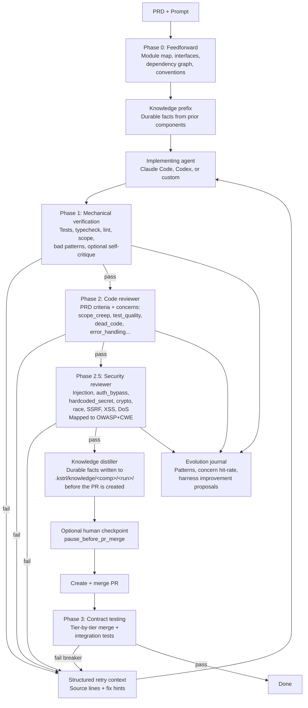
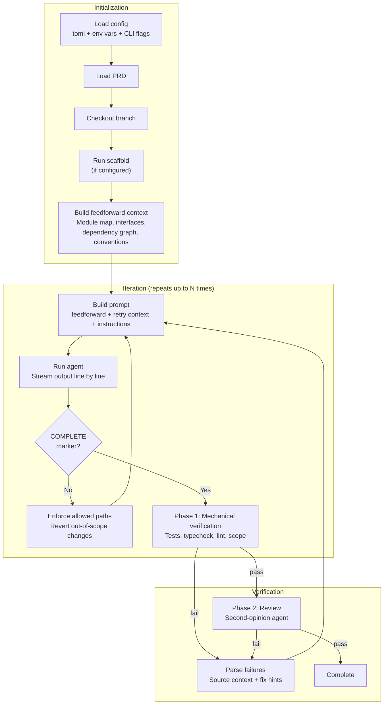
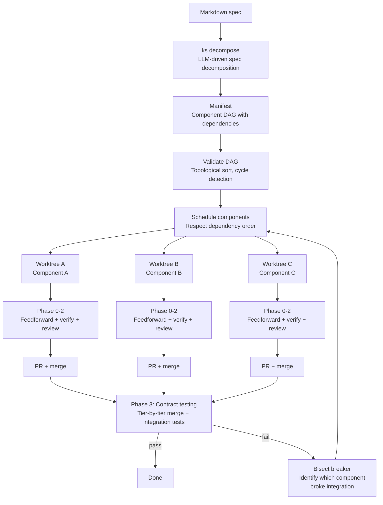
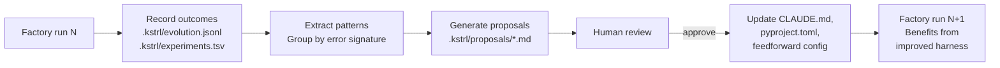

# kstrl architecture

The low-level tour: what runs, in what order, and where state lives. The
[README](README.md) stays at product level; this file holds the detailed
diagrams and mechanics. Companion docs:

- [docs/adversarial-design.md](docs/adversarial-design.md) - the 8-role
  adversarial taxonomy, design invariants, and known limitations
- [docs/env-vars.md](docs/env-vars.md) - every environment variable
- [docs/runbook.md](docs/runbook.md) - operator failure recovery
- [DESIGN.md](DESIGN.md) / [PRODUCT.md](PRODUCT.md) - the TUI visual system
  and product principles
- [docs/linear-integration.md](docs/linear-integration.md) - the optional
  Linear mirror

## The pipeline

Every component - whether from `ks run` (single component) or a factory
run (many) - moves through the same phase chain:

Phase 0 also includes an architect/PRD-red-team pass at decompose time
that halts on blocker-severity spec issues; its findings persist to
`scripts/kstrl/spec-issues.json`.

Phase numbering is sticky by convention: Phase 0 feedforward, Phase 1
mechanical verification, Phase 2 code review, Phase 2.5 security review,
Phase 3 contract testing. New phases get fractional numbers so ordering
semantics never change.

### Phase 0: Feedforward

Computed fresh each iteration - no LLM calls, no token cost:

- **Module map** - directory tree with file counts and lines of code
- **Public interfaces** - classes and function signatures extracted via
  Python's `ast` module
- **Dependency graph** - internal import relationships (Python imports)
- **Active conventions** - line length, quote style, type-checking mode
  from pyproject.toml, ruff.toml, .editorconfig

Feedforward is distinct from the knowledge prefix: feedforward is
*computed* from the current tree; knowledge facts are *distilled* by an
LLM from prior components' verified work and re-validated on read.

### Phases 1-3: Verification

**Phase 1 - mechanical** (computational, fast): test suite, typecheck,
linter, diff-scope (rename-aware; changes outside `allowedPaths` fail),
bad-pattern scan (empty files, syntax errors, leaked secrets), optional
mutation testing, dead-code check, self-critique shape check, and the
approved-fixtures oracle when enabled (see below).

**Phase 2 / 2.5 - adversarial review** (LLM): independent reviewer and
security-reviewer passes over the diff, wrapped in per-run random data
delimiters so in-diff text cannot forge instructions. Oversized diffs are
chunked on file boundaries; in hard mode an unreviewable diff fails
closed, never silently passes. When a second model family's CLI is
available, review defaults to the opposite family from the engineer
(cross-model rotation), and every finding carries its reviewing-model tag.

**Phase 3 - contract** (multi-component runs): merges component branches
tier-by-tier in a detached temp worktree (never the operator's checkout)
and runs integration tests at each tier, bisecting to attribute failures
where merge order makes that meaningful.

Failed checks are parsed into structured failures - file, line, source
context, fix hint - and fed into the next iteration's prompt rather than
raw stderr.

## The iteration loop

Inside one component's execution:

Guardrails around the loop: allowed-paths enforcement runs BEFORE the
completion early-return (a COMPLETE marker cannot bypass it), a
no-progress circuit breaker halts a component when consecutive iterations
produce an unchanged diff hash and test signature, and per-phase timeouts
are enforced end to end (agent subprocesses run in their own process
groups with deadline kills, so a hung grandchild dies with its parent).

## Factory mode

The decompose step is itself adversarial: the architect red-teams the
spec (halting on blocker-severity issues rather than inventing behavior)
and must emit `allowedPaths` per component, validated against a
harness-internals exclude list. Component branches cut from
`origin/<base>` so squash-merged dependencies are built upon, not stale
local refs; a component that hits a merge conflict is re-run against the
freshly merged base instead of rebasing agent output. Completion is
merge-gated: a component is COMPLETED only when its PR actually merged
(or PR creation is disabled), and a merge timeout parks it as
MERGE_PENDING without scheduling dependents past it.

## The learning loop

Failures are journaled as structured signatures (`linter:E501`,
`typecheck:arg-type`, `diff_scope:rename`), not flattened strings;
review/security failures record finding categories. `ks evolve` derives
proposals from those taxonomies, and applying a convention-type proposal
appends to the project CLAUDE.md only after explicit confirmation -
everything else prints instructions for manual action. Metrics semantics
are documented in [docs/evolution-metrics.md](docs/evolution-metrics.md).

## The event-stream substrate

The TUI is a view, never the record. Every run - factory, decompose,
feature, understand - appends typed, schema-versioned events to
`.kstrl/runs/<run_id>/events.jsonl` (run ids are kind-prefixed:
`factory-…`, `decompose-…`), per-component transcripts and events to
`components/<id>/engineer.{log,jsonl}`, and adversarial phase transcripts
to `components/<id>/{review,security,distill}.log`. Non-factory commands
project their work onto a pseudo-component (`architect`, the feature
name, `understand`) so the same board, reducer, and replay machinery
serve every kind. `ks dash` and the embedded views tail the same files -
which is why attaching mid-run, replaying a finished run, and surviving a
dashboard crash all work by construction. Recording obeys the
`[factory] progress_log_enabled` switch everywhere, and the legacy
`.kstrl/progress.jsonl` keeps being written byte-compatibly by factory
runs for existing consumers.

Token and cost figures are CLI self-reports: when any call goes
unreported the meter renders a `+` marker and treats the total as a
lower bound - an honest number is never turned into a false one.

## Runtime state layout

Everything lives under `.kstrl/` at the project root (gitignored):

| Path | What |
|---|---|
| `.kstrl/runs/<run_id>/` | Event log + per-component transcripts per run |
| `.kstrl/worktrees/<run>/<component>/` | Isolated git worktrees (run-keyed, never shared across invocations) |
| `.kstrl/knowledge/<component>/<run>/` | Distilled facts (latest-wins by fact id; re-validated on read) |
| `.kstrl/evolution.jsonl`, `.kstrl/experiments.tsv` | Learning-loop journals |
| `.kstrl/proposals/` | Harness improvement proposals |
| `.kstrl/snapshots/` | Approved-fixture output snapshots |
| `.kstrl/factory.lock` | Run-level flock: a second invocation on the same root refuses to start |

A repo that still has a pre-rename `.ralph/` directory gets a one-time
warning with the migration command (`mv .ralph .kstrl`); state is never
auto-moved.

## The fixtures sandbox

Approved fixtures (README: "Approved fixtures") are the independent
oracle against agent-authored tests. Because the PRD is LLM-emitted,
fixture definitions are treated as untrusted input:

- **`cli` fixtures run without a shell.** The command string is split
  with `shlex` and executed directly, so pipes, redirection, `&&`,
  `$VAR` expansion, and globbing are unsupported; metacharacters reach
  the program as literal arguments. Each command runs with a scrubbed
  environment (no API keys or tokens) in its own process group with a
  timeout.
- **`function` fixtures run in a subprocess**, never in the harness
  process. The module/function spec travels as JSON to a
  `sys.executable` runner with cwd set to the component worktree, the
  same scrubbed environment, and a timeout. Consequences: fixtures run
  under the harness's Python interpreter (not the project's venv), so
  keep them free of project-only third-party imports; and the `returns`
  comparison is JSON-shaped (dicts, lists, strings, numbers, booleans,
  null).
- **`file` fixtures cannot leave the worktree.** Absolute paths, `..`
  components, and symlink escapes are rejected.

The schema is strict: unknown keys anywhere in a fixture entry are
rejected at PRD validation, because a misspelled expectation key
(`stdout_containz`) would otherwise be silently ignored and the fixture
would pass vacuously.

**Snapshot regression**, behind the same `enabled` flag: when every
fixture passes, actual outputs are saved to `snapshot_dir` keyed by
component id; later runs fail Phase 1 if a previously-passing fixture
fails or its output changes. If a change is intentional, delete
`.kstrl/snapshots/<component>.json` to reset the baseline. Snapshots
resolve against the repo root, not the worktree, so they survive
worktree recreation between runs.
