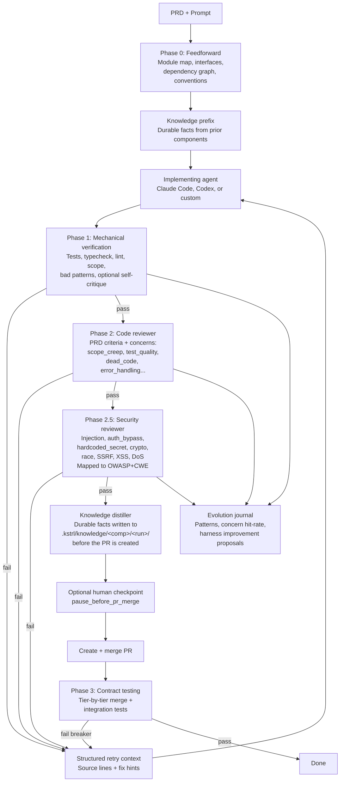
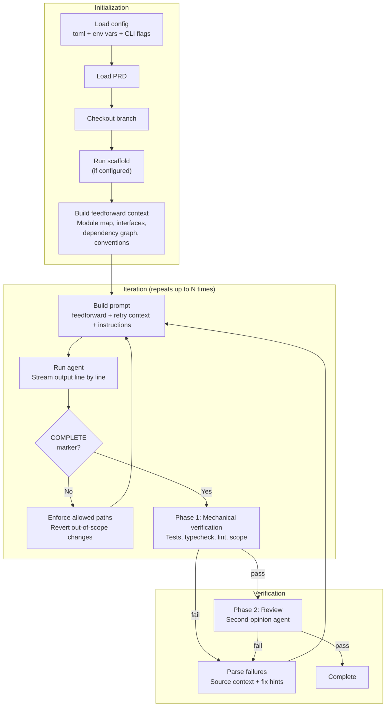
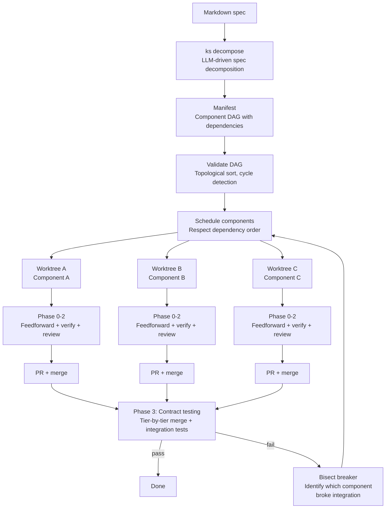
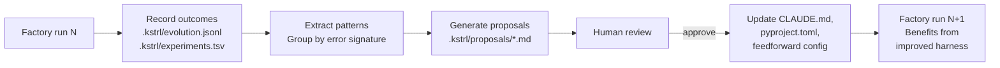

# kstrl architecture

The low-level tour: what runs, in what order, and where state lives. The
[README](README.md) stays at product level; this file holds the detailed
diagrams and mechanics. Companion docs:

- [docs/adversarial-design.md](docs/adversarial-design.md) - the 8-role
  adversarial taxonomy, design invariants, and known limitations
- [docs/env-vars.md](docs/env-vars.md) - every environment variable
- [docs/runbook.md](docs/runbook.md) - operator failure recovery
- [DESIGN.md](DESIGN.md) / [PRODUCT.md](PRODUCT.md) - the TUI visual system
  and product principles
- [docs/linear-integration.md](docs/linear-integration.md) - the optional
  Linear mirror

**See it before you read it.** The live system atlas at
<https://0xfauzi.github.io/kstrl/atlas/> is generated from this code: every
component, what it does, what flows between them and in which direction,
which parts are built and which are planned, in layers you can switch
between. Click any component to see what it is to its neighbours. This
document is the prose companion to that map; when they disagree, the map is
regenerated from the code and this file is what needs fixing.

## The loops

kstrl is a software factory built as a control loop, and it is easier to read
as several loops nested inside each other than as one pipeline. Each loop has
a target it steers toward, something that acts, something that measures the
result independently of the thing that acted, and a clock. The phase chain in
the next section is what happens inside one tick of the two middle loops.

| Rate | Loop | What acts | What measures | What it steers toward |
|---|---|---|---|---|
| seconds | implement | the engineer agent | nothing yet (the breaker and the scope fence watch it, neither reads the code) | one story's acceptance criteria |
| minutes | accept | a retry with a structured context | mechanical verification, the reviewer, the security reviewer | the component's PRD |
| tens of minutes | integrate | scheduling and merging | contract tests | the manifest satisfied |
| hours | intake | queue admission | queue state, spend, the inbox cap | the queue drained within bounds |
| days | trust | the autonomy level | run outcomes, calibration | the autonomy the evidence supports |
| weeks | learn | facts, proposals | fact utilisation | the harness's own detection rates |
| days | operate (planned: R8.7, R8.8) | the release driver | runtime errors, health probes | the shipped service's objectives |

The rule that holds every loop together: **what acts never measures its own
result.** The engineer sets a story's `passes` flag; that is a claim, and the
reviewer's per-criterion verdict is the measurement (the R10 cycle makes the
two agree before a story counts as done). A reviewer's own claim to have
searched thoroughly is shown and never gates; calibration against planted
bugs is what says a reviewer works. A skipped phase leaves a finding saying
so, which is why an empty findings list means every check ran and found
nothing.

Which loops are closed today, which wind up, and which are open, with the
code cited line by line, is in
[docs/control-loop-design.md](docs/control-loop-design.md). The plan that
closes the rest is the R10 milestone.

## The pipeline: one tick of the accept and integrate loops

Every component - whether from `ks run` (single component) or a factory
run (many) - moves through the same phase chain:

```mermaid
flowchart TD
    PRD["PRD + Prompt"] --> FF["Phase 0: Feedforward<br/>Module map, interfaces,<br/>dependency graph, conventions"]
    FF --> Knowledge["Knowledge prefix<br/>Durable facts from prior components"]
    Knowledge --> Agent["Implementing agent<br/>Claude Code, Codex, or custom"]
    Agent --> P1["Phase 1: Mechanical verification<br/>Tests, typecheck, lint, scope,<br/>bad patterns, optional self-critique"]
    P1 -->|fail| Retry["Structured retry context<br/>Source lines + fix hints"]
    Retry --> Agent
    P1 -->|pass| P2["Phase 2: Code reviewer<br/>PRD criteria + concerns:<br/>scope_creep, test_quality,<br/>dead_code, error_handling..."]
    P2 -->|fail| Retry
    P2 -->|pass| P25["Phase 2.5: Security reviewer<br/>Injection, auth_bypass,<br/>hardcoded_secret, crypto,<br/>race, SSRF, XSS, DoS<br/>Mapped to OWASP+CWE"]
    P25 -->|fail| Retry
    P25 -->|pass| Distill["Knowledge distiller<br/>Durable facts written to<br/>.kstrl/knowledge/&lt;comp&gt;/&lt;run&gt;/<br/>before the PR is created"]
    Distill --> HITL["Optional human checkpoint<br/>pause_before_pr_merge"]
    HITL --> PR["Create + merge PR"]
    PR --> P3["Phase 3: Contract testing<br/>Tier-by-tier merge +<br/>integration tests"]
    P3 -->|fail breaker| Retry
    P3 -->|pass| Done["Done"]
    P1 --> Journal["Evolution journal<br/>Patterns, concern hit-rate,<br/>harness improvement proposals"]
    P2 --> Journal
    P25 --> Journal
```

Phase 0 also includes an architect/PRD-red-team pass at decompose time
that halts on blocker-severity spec issues; its findings persist to
`scripts/kstrl/spec-issues.json`.

Phase numbering is sticky by convention: Phase 0 feedforward, Phase 1
mechanical verification, Phase 2 code review, Phase 2.5 security review,
Phase 3 contract testing. New phases get fractional numbers so ordering
semantics never change.

### Phase 0: Feedforward

Computed fresh each iteration - no LLM calls, no token cost:

- **Module map** - directory tree with file counts and lines of code
- **Public interfaces** - classes and function signatures extracted via
  Python's `ast` module
- **Dependency graph** - internal import relationships (Python imports)
- **Active conventions** - line length, quote style, type-checking mode
  from pyproject.toml, ruff.toml, .editorconfig

Feedforward is distinct from the knowledge prefix: feedforward is
*computed* from the current tree; knowledge facts are *distilled* by an
LLM from prior components' verified work and re-validated on read.

### Phases 1-3: Verification

**Phase 1 - mechanical** (computational, fast): test suite, typecheck,
linter, diff-scope (rename-aware; changes outside `allowedPaths` fail),
bad-pattern scan (empty files, syntax errors, leaked secrets), optional
mutation testing, dead-code check, self-critique shape check, and the
approved-fixtures oracle when enabled (see below).

**Phase 2 / 2.5 - adversarial review** (LLM): independent reviewer and
security-reviewer passes over the diff, wrapped in per-run random data
delimiters so in-diff text cannot forge instructions. Oversized diffs are
chunked on file boundaries; in hard mode an unreviewable diff fails
closed, never silently passes. When a second model family's CLI is
available, review defaults to the opposite family from the engineer
(cross-model rotation), and every finding carries its reviewing-model tag.

**Phase 3 - contract** (multi-component runs): merges component branches
tier-by-tier in a detached temp worktree (never the operator's checkout)
and runs integration tests at each tier, bisecting to attribute failures
where merge order makes that meaningful.

Failed checks are parsed into structured failures - file, line, source
context, fix hint - and fed into the next iteration's prompt rather than
raw stderr.

## The iteration loop

Inside one component's execution. Note what this loop does not have: the
prompt is assembled once, before the `for` loop (`kstrl/loop.py`), and the
same string is sent on every iteration. Information crosses an iteration
boundary only through the files the agent itself writes (the PRD, the
progress log, the codebase map). Nothing measures the tree between
iterations; every sensor sits one loop up, in the phase chain above. Adding a
fast sensor here is R10.12, gated on evidence that the loop actually iterates
(in the recorded runs so far it completes on iteration one).

```mermaid
flowchart TD
    subgraph Init["Initialization"]
        A1["Load config<br/>toml + env vars + CLI flags"] --> A2["Load PRD"]
        A2 --> A3["Checkout branch"]
        A3 --> A4["Run scaffold<br/>(if configured)"]
        A4 --> A5["Build feedforward context<br/>Module map, interfaces,<br/>dependency graph, conventions"]
    end

    subgraph Iteration["Iteration (repeats up to N times)"]
        B1["Build prompt<br/>feedforward + retry context + instructions"] --> B2["Run agent<br/>Stream output line by line"]
        B2 --> B3{"COMPLETE<br/>marker?"}
        B3 -->|No| B4["Enforce allowed paths<br/>Revert out-of-scope changes"]
        B4 --> B1
        B3 -->|Yes| B5["Phase 1: Mechanical verification<br/>Tests, typecheck, lint, scope"]
    end

    subgraph Verify["Verification"]
        B5 -->|fail| B6["Parse failures<br/>Source context + fix hints"]
        B6 --> B1
        B5 -->|pass| B7["Phase 2: Review<br/>Second-opinion agent"]
        B7 -->|fail| B6
        B7 -->|pass| B8["Complete"]
    end

    A5 --> B1
```

Guardrails around the loop: allowed-paths enforcement runs BEFORE the
completion early-return (a COMPLETE marker cannot bypass it), a
no-progress circuit breaker halts a component when consecutive iterations
produce an unchanged diff hash and test signature, and per-phase timeouts
are enforced end to end (agent subprocesses run in their own process
groups with deadline kills, so a hung grandchild dies with its parent).

## Factory mode

```mermaid
flowchart TD
    Spec["Markdown spec"] --> Decompose["ks decompose<br/>LLM-driven spec decomposition"]
    Decompose --> Manifest["Manifest<br/>Component DAG with dependencies"]
    Manifest --> Validate["Validate DAG<br/>Topological sort, cycle detection"]
    Validate --> Schedule["Schedule components<br/>Respect dependency order"]

    Schedule --> WT1["Worktree A<br/>Component A"]
    Schedule --> WT2["Worktree B<br/>Component B"]
    Schedule --> WT3["Worktree C<br/>Component C"]

    WT1 --> V1["Phase 0-2<br/>Feedforward + verify + review"]
    WT2 --> V2["Phase 0-2<br/>Feedforward + verify + review"]
    WT3 --> V3["Phase 0-2<br/>Feedforward + verify + review"]

    V1 --> PR1["PR + merge"]
    V2 --> PR2["PR + merge"]
    V3 --> PR3["PR + merge"]

    PR1 --> Contract["Phase 3: Contract testing<br/>Tier-by-tier merge + integration tests"]
    PR2 --> Contract
    PR3 --> Contract

    Contract -->|pass| Done["Done"]
    Contract -->|fail| Bisect["Bisect breaker<br/>Identify which component<br/>broke integration"]
    Bisect --> Schedule
```

The decompose step is itself adversarial: the architect red-teams the
spec (halting on blocker-severity issues rather than inventing behavior)
and must emit `allowedPaths` per component, validated against a
harness-internals exclude list. Component branches cut from
`origin/<base>` so squash-merged dependencies are built upon, not stale
local refs; a component that hits a merge conflict is re-run against the
freshly merged base instead of rebasing agent output. Completion is
merge-gated: a component is COMPLETED only when its PR actually merged
(or PR creation is disabled), and a merge timeout parks it as
MERGE_PENDING without scheduling dependents past it.

## The learning loop

What is drawn below is the intended shape. Today it is open at the last edge:
proposals are written and nothing reads them back into a run, and no
mechanism yet checks whether an applied proposal helped. The one learning
path that is closed is the per-component knowledge layer (distill facts,
inject them into later components, measure their uptake as a lower bound).
The design that closes the rest, with attribution and a playbook shared
across projects, is [docs/continuous-learning-design.md](docs/continuous-learning-design.md) (R9).

```mermaid
flowchart LR
    Run1["Factory run N"] --> Record["Record outcomes<br/>.kstrl/evolution.jsonl<br/>.kstrl/experiments.tsv"]
    Record --> Extract["Extract patterns<br/>Group by error signature"]
    Extract --> Propose["Generate proposals<br/>.kstrl/proposals/*.md"]
    Propose --> Review["Human review"]
    Review -->|approve| Apply["Update CLAUDE.md,<br/>pyproject.toml,<br/>feedforward config"]
    Apply --> Run2["Factory run N+1<br/>Benefits from<br/>improved harness"]
```

Failures are journaled as structured signatures (`linter:E501`,
`typecheck:arg-type`, `diff_scope:rename`), not flattened strings;
review/security failures record finding categories. `ks evolve` derives
proposals from those taxonomies, and applying a convention-type proposal
appends to the project CLAUDE.md only after explicit confirmation -
everything else prints instructions for manual action. Metrics semantics
are documented in [docs/evolution-metrics.md](docs/evolution-metrics.md).

## The event-stream substrate

The TUI is a view, never the record. Every run - factory, decompose,
feature, understand - appends typed, schema-versioned events to
`.kstrl/runs/<run_id>/events.jsonl` (run ids are kind-prefixed:
`factory-…`, `decompose-…`), per-component transcripts and events to
`components/<id>/engineer.{log,jsonl}`, and adversarial phase transcripts
to `components/<id>/{review,security,distill}.log`. Non-factory commands
project their work onto a pseudo-component (`architect`, the feature
name, `understand`) so the same board, reducer, and replay machinery
serve every kind. `ks dash` and the embedded views tail the same files -
which is why attaching mid-run, replaying a finished run, and surviving a
dashboard crash all work by construction. Recording obeys the
`[factory] progress_log_enabled` switch everywhere, and the legacy
`.kstrl/progress.jsonl` keeps being written byte-compatibly by factory
runs for existing consumers.

The same event bus feeds the optional Linear mirror: a `LinearSink`
subscribes to progress events and comments on component issues at
failure and budget-halt moments, while status transitions ride branch
names and PR trailers with zero API calls
([docs/linear-integration.md](docs/linear-integration.md)).

Token and cost figures are CLI self-reports: when any call goes
unreported the meter renders a `+` marker and treats the total as a
lower bound - an honest number is never turned into a false one.

## Runtime state layout

Everything lives under `.kstrl/` at the project root (gitignored):

| Path | What |
|---|---|
| `.kstrl/runs/<run_id>/` | Event log + per-component transcripts per run |
| `.kstrl/worktrees/<run>/<component>/` | Isolated git worktrees (run-keyed, never shared across invocations) |
| `.kstrl/knowledge/<component>/<run>/` | Distilled facts (latest-wins by fact id; re-validated on read) |
| `.kstrl/evolution.jsonl`, `.kstrl/experiments.tsv` | Learning-loop journals |
| `.kstrl/proposals/` | Harness improvement proposals |
| `.kstrl/snapshots/` | Approved-fixture output snapshots |
| `.kstrl/factory.lock` | Run-level flock: a second invocation on the same root refuses to start |

## The fixtures sandbox

Approved fixtures (README: "Approved fixtures") are the independent
oracle against agent-authored tests. Because the PRD is LLM-emitted,
fixture definitions are treated as untrusted input:

- **`cli` fixtures run without a shell.** The command string is split
  with `shlex` and executed directly, so pipes, redirection, `&&`,
  `$VAR` expansion, and globbing are unsupported; metacharacters reach
  the program as literal arguments. Each command runs with a scrubbed
  environment (no API keys or tokens) in its own process group with a
  timeout.
- **`function` fixtures run in a subprocess**, never in the harness
  process. The module/function spec travels as JSON to a
  `sys.executable` runner with cwd set to the component worktree, the
  same scrubbed environment, and a timeout. Consequences: fixtures run
  under the harness's Python interpreter (not the project's venv), so
  keep them free of project-only third-party imports; and the `returns`
  comparison is JSON-shaped (dicts, lists, strings, numbers, booleans,
  null).
- **`file` fixtures cannot leave the worktree.** Absolute paths, `..`
  components, and symlink escapes are rejected.

The schema is strict: unknown keys anywhere in a fixture entry are
rejected at PRD validation, because a misspelled expectation key
(`stdout_containz`) would otherwise be silently ignored and the fixture
would pass vacuously.

**Snapshot regression**, behind the same `enabled` flag: when every
fixture passes, actual outputs are saved to `snapshot_dir` keyed by
component id; later runs fail Phase 1 if a previously-passing fixture
fails or its output changes. If a change is intentional, delete
`.kstrl/snapshots/<component>.json` to reset the baseline. Snapshots
resolve against the repo root, not the worktree, so they survive
worktree recreation between runs.

## Glossary

The words this document and the atlas use, defined once, with the kstrl noun
each maps to.

| Word | Meaning here |
|---|---|
| plant | the thing being changed: the target repository, and after release, the running service |
| set point | the state a loop steers toward: acceptance criteria, the policy envelope, the adequacy floor |
| sensor | anything that measures the plant independently of the agent that changed it |
| measurement versus claim | a claim is what the agent says about its work (the `passes` flag, the completion marker); a measurement is what a sensor reads from the diff. Claims are rendered; measurements gate |
| finding | the typed record every sensor emits when the work misses the set point; the error signal |
| controller | the code that turns findings into the next action: retry, halt, merge, demote |
| actuator | the engineer agent; later, the release driver |
| feedforward | context computed from the tree and given to the agent before it acts (Phase 0) |
| disturbance | change the loop did not command: model non-determinism, transport failures, a moving base branch |
| retry context | the parsed failures handed to the next attempt |
| breaker | the stall detector: halts a component after N iterations with an unchanged diff and test signature |
| policy envelope | the written merge rules enforced on the diff and lockfile; enforcement-machinery paths halt at every level |
| autonomy ladder | L1 to L4; promotion needs evidence plus a human acknowledgement; demotion is automatic; the permission bundle can only withhold |
| control directory | the factory's own state, kept outside the repository so the agent cannot edit its governor |
| inbox | every decision waiting for a human, in one place |
| advisory first | a gate ships measuring without blocking and graduates on the operator's judgement after real runs |
| on the loop | where the operator stands: the system runs itself, the operator intervenes on exception and adjusts between runs |
