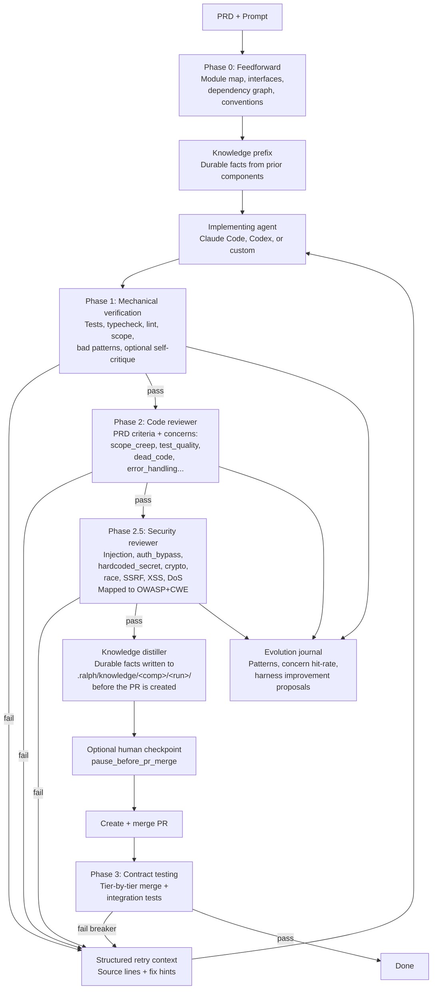
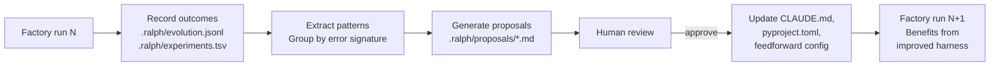
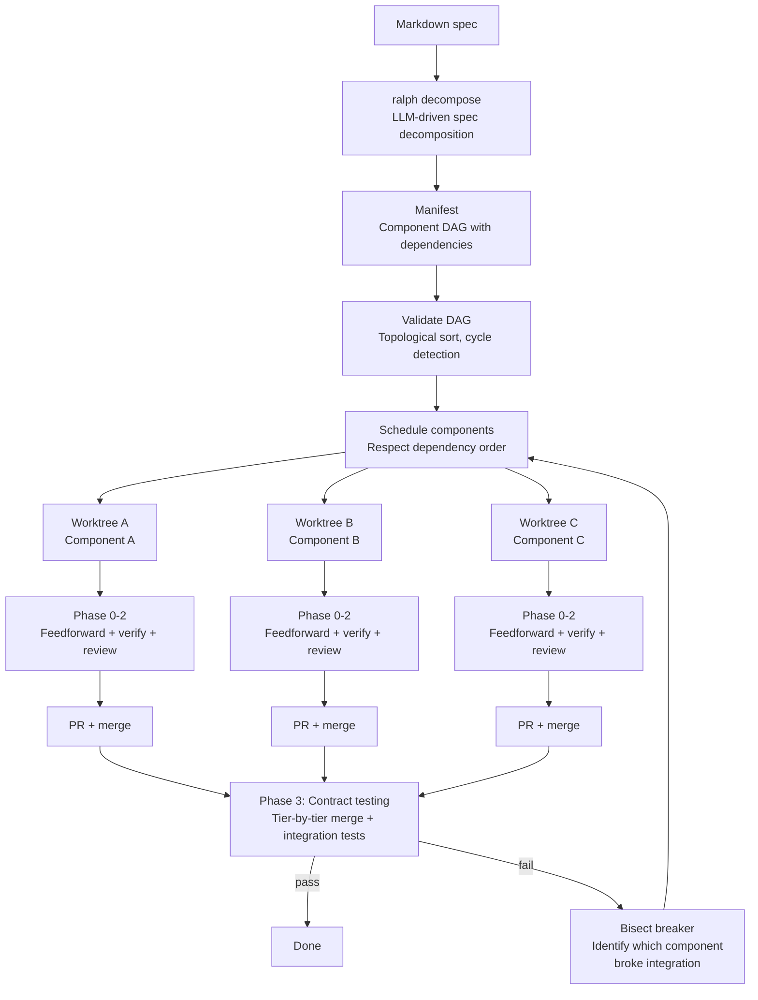
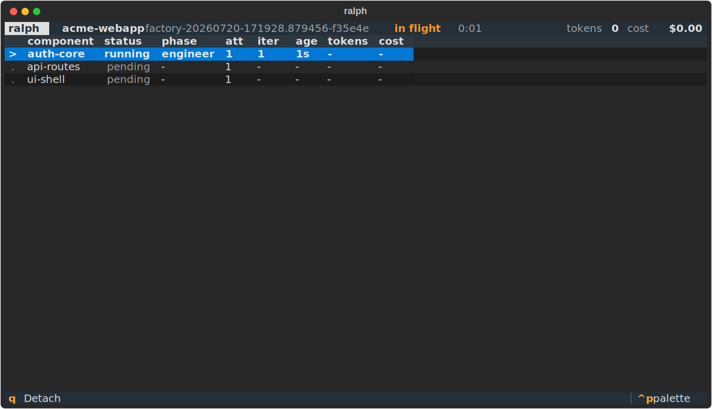
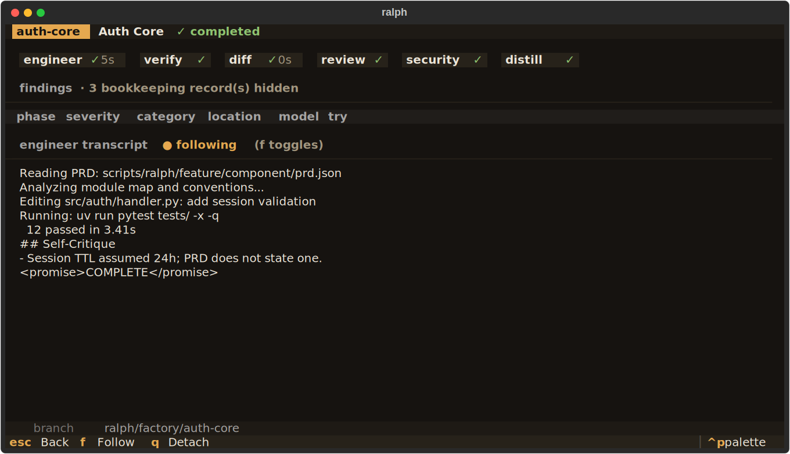
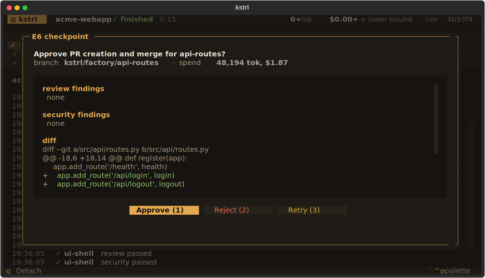
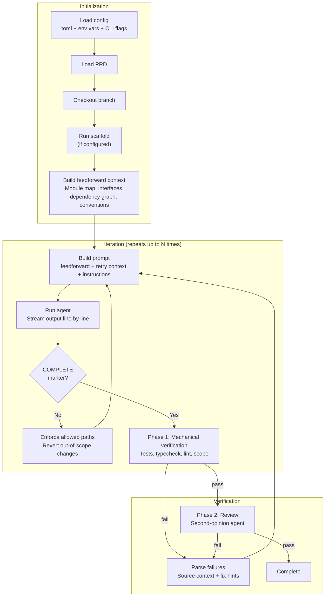
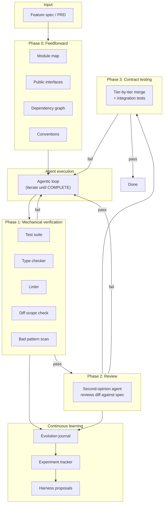

# Ralph

[](https://github.com/0xfauzi/ralph-loop/actions/workflows/ci.yml)
[](pyproject.toml)
[](LICENSE)

Ralph is a harness for AI coding agents. You hand it a feature spec and walk away. It steers the agent with codebase context, verifies the output with structured checks, retries with actionable feedback, and learns from its mistakes across runs.

The problem it solves: AI coding agents are powerful, but they work on a single prompt at a time. If the agent doesn't finish in one shot, you're back to manually re-prompting, checking progress, and deciding what to try next. And even when the agent says "done," there's no guarantee the code actually works. Ralph automates the outer loop - iteration, verification, and improvement - so the agent produces working code, not just code that claims to work. And because walk-away automation is only trustworthy when you can see what it did, every run streams a typed event log you can watch live in a terminal dashboard, attach to from another terminal, or replay after the fact.

## What makes ralph different

Most agent wrappers are retry loops: run the agent, check if it's done, retry if not. Ralph applies harness engineering - a combination of feedforward controls (steer the agent before it acts) and feedback sensors (verify after it acts) to systematically increase confidence in agent output.



Phase 0 also includes an architect/PRD-red-team pass at decompose time that halts on blocker-severity spec issues.

**Documentation**: [docs/adversarial-design.md](docs/adversarial-design.md) covers the full 8-role taxonomy, [docs/env-vars.md](docs/env-vars.md) every environment variable, [docs/runbook.md](docs/runbook.md) operator failure recovery, and [docs/linear-integration.md](docs/linear-integration.md) the optional Linear mirror. [examples/](examples/) has a scaffolded uv project and two sample feature specs.

## Quick start

Ralph is not published to PyPI - the `ralph-cli` name there belongs to an unrelated project. Install from a clone:

```bash
git clone https://github.com/0xfauzi/ralph-loop.git
cd ralph-loop
uv tool install -e .               # installs the `ralph` command (requires Python 3.11+, uv)

cd your-project
ralph init .                       # scaffold ralph.toml and prompt/PRD templates
$EDITOR scripts/ralph/prd.json     # define what to build (user stories + acceptance criteria)
ralph run 25                       # let the agent work for up to 25 iterations
```

Factory runs on a terminal open a live dashboard automatically (`--no-tui` opts out); `ralph dash` attaches a read-only view to any run - in flight or finished - from another terminal, and `ralph status` prints the same state for scripts and CI.

You need at least one AI coding agent CLI:

| Agent | Install | Example models |
|-------|---------|----------------|
| Claude Code (recommended) | [claude.ai/code](https://claude.ai/code) | sonnet, opus, haiku |
| OpenAI Codex | [github.com/openai/codex](https://github.com/openai/codex) | gpt-5, o3 |
| Custom | Any command that reads stdin | - |

Ralph does not validate model names: `[agent].model` is passed straight through to the CLI (`claude --model` / `codex -m`), so any model the installed CLI accepts works.

There is also an opt-in in-process adapter, `[agent] type = "claude-sdk"`, that drives Claude through the [Claude Agent SDK](https://docs.claude.com/en/api/agent-sdk/overview) instead of a CLI subprocess and supports an in-loop USD budget ceiling (`[agent].budget_usd`). It requires the `sdk` extra (`uv sync --extra sdk`) and is never chosen by auto-detect.

**Python-first**: Ralph works best on Python projects managed with uv. The feedforward interface and dependency analysis parse Python (`ast` and import statements), and the default verification commands are `uv run pytest` / `uv run mypy` / `uv run ruff check`. Other stacks work by overriding the `[verify]` commands in ralph.toml, but they get a reduced feedforward context (module map and conventions only).

## How it works

### Phase 0: Feedforward - give the agent context before it starts

Before the agent writes a single line, ralph computationally analyzes the codebase and injects structural context into the prompt. No LLM calls, no token cost - pure static analysis:

- **Module map** - directory tree with file counts and lines of code
- **Public interfaces** - classes and function signatures extracted via Python's `ast` module
- **Dependency graph** - internal import relationships between modules (Python imports only)
- **Active conventions** - line length, quote style, type checking mode from pyproject.toml, ruff.toml, .editorconfig

This reduces wasted iterations. The agent knows "this project uses httpx, not requests" before it starts, instead of learning it from a linter failure on iteration 3.

### Phases 1-3: Verification - check the output, not just the completion marker

When the agent signals completion, ralph doesn't just trust it. Every run goes through mechanical verification:

**Phase 1 - Mechanical checks** (computational, fast):
- Test suite passes
- Type checker passes
- Linter passes
- No changes outside allowed paths
- No leaked secrets or syntax errors
- Optional: mutation testing, dead-code check, self-critique shape check

**Phase 2 - Second-opinion review** (inferential, LLM-based):
- A separate agent reviews the diff against the acceptance criteria
- Modes: `hard` (failures block), `advisory` (warn only), `skip`

**Phase 3 - Contract testing** (for multi-component runs):
- Merges component branches tier-by-tier
- Runs integration tests at each tier
- Bisects to identify which component broke integration

When verification fails, ralph doesn't dump raw stderr into the retry prompt. It parses tool output into structured failures with file paths, source context, and fix hints:

```
[mypy] Found 1 error in 1 file (checked 14 source files)
  src/api/auth.py:23 [arg-type] Argument 1 to "verify_password" has incompatible type "str | None"; expected "str"
    |     21 |     password = request.form.get("password")
    |     22 |     user = get_user(username)
    | >   23 |     if verify_password(password, user.password_hash):
    |     24 |         return create_token(user)
    hint: Type mismatch in argument - convert or check the value before passing it.
```

### Continuous learning - the harness improves itself

After each factory run, ralph records outcomes to an evolution journal. Over multiple runs, it identifies recurring failure patterns and proposes harness improvements.



```bash
ralph evolve              # analyze recent runs, find patterns
ralph evolve --status     # show experiment trends (retry rate over time)
```

If the agent keeps triggering the same linter rule across components, `ralph evolve` proposes adding a convention to CLAUDE.md. If typecheck failures recur on Optional types, it proposes a mypy config change. Proposals are written as markdown files for human review.

This is the meta-loop: ralph doesn't just retry - it learns what causes failures and updates its own controls to prevent them.

## Factory mode - parallel multi-component execution

For large features, ralph decomposes a spec into independent components and runs them in parallel:

```bash
ralph decompose --spec features.md --project-name myproject
ralph factory --manifest scripts/ralph/manifest.json --max-parallel 4
```

Each component runs in an isolated git worktree (`.ralph/worktrees/<run>/<component>`) with its own PRD. `ralph run` is actually factory mode with a single component - the same verification pipeline runs whether you're building one feature or twenty.



## The dashboard - watch the factory work

`ralph factory` on a terminal runs an embedded [Textual](https://github.com/Textualize/textual) dashboard (plain output remains the default for non-TTY use, `--ui plain`, `--no-tui`, or `RALPH_NO_TUI=1`). The screenshots below are real: captured from a live toy-project factory run driven by a scripted agent, mid-flight and after completion.

The overview board shows every component's status, authoritative phase, attempt, last-event age, and spend - here with `auth-core` and `api-routes` running in parallel workers while `ui-shell` waits on its dependency:



`enter` drills into a component: the phase timeline with verdicts and durations, the typed adversarial findings stream (severity and reviewing-model attribution), the live engineer transcript, and the evidence paths you would visit if something broke:



With `pause_before_pr_merge` enabled, the E6 human checkpoint opens as a real inspection surface - the diff excerpt, both finding streams, and what the attempt cost - instead of a y/n prompt. `a` approves, `r` rejects (fails the component and skips dependents), `t` consumes a retry, `escape` leaves it pending while you look around the dashboard:



Keys: `enter` component detail, `escape` back, `f` toggle transcript follow, `c` reopen a pending checkpoint, `q` quit. Quit semantics differ by mode: in `ralph dash` (observe-only) `q` detaches immediately; embedded, `q` asks first - confirming group-kills in-flight agents, runs worktree cleanup, flushes the manifest, and exits 130, and a second `q` (or Ctrl-C) force-kills.

The dashboard is a view, never the record. Every run appends typed schema-versioned events to `.ralph/runs/<run_id>/events.jsonl`, per-component engineer transcripts and events to `components/<id>/engineer.{log,jsonl}`, and adversarial phase transcripts to `components/<id>/{review,security,distill}.log`. `ralph dash` and the embedded view tail the same files - which is why attaching mid-run, replaying a finished run, and surviving a dashboard crash all work by construction. The legacy `.ralph/progress.jsonl` keeps being written byte-compatibly for existing consumers.

One honesty note carried through every surface: token and cost figures are CLI self-reports, so whenever any call went unreported the meter renders a `+` marker and treats the total as a lower bound - the dashboard never turns an honest number into a false one.

## Approved fixtures - behavioral verification you control

Agent-generated tests can be written to pass trivially. Approved fixtures are input/output pairs, declared in the PRD, that the agent's code must satisfy - they run during Phase 1 mechanical verification, outside the project's own pytest, so a gamed conftest cannot deselect them.

Fixtures are **off by default**. Enable them in ralph.toml (they also do nothing unless the PRD has a `fixtures` array):

```toml
[fixtures]
enabled = true
```

```json
{
  "branchName": "ralph/auth",
  "fixtures": [
    {
      "description": "Login returns token",
      "fixture_type": "cli",
      "input_data": {"command": "curl -s localhost:8000/api/login -d '{\"user\":\"test\"}'"},
      "expected": {"exit_code": 0, "stdout_contains": ["token"]}
    },
    {
      "description": "Config is importable",
      "fixture_type": "function",
      "input_data": {"module": "src.config", "function": "get_settings", "args": []},
      "expected": {"returns": {"debug": false}}
    },
    {
      "description": "Migration file exists",
      "fixture_type": "file",
      "input_data": {"path": "migrations/001_users.sql"},
      "expected": {"exists": true, "contains": ["CREATE TABLE users"]}
    }
  ],
  "userStories": [...]
}
```

Three fixture types: `cli` (run a command, check output), `function` (import and call, check return), `file` (check existence and content). The schema is strict: unknown keys anywhere in a fixture entry are rejected at PRD validation, because a misspelled expectation key (`stdout_containz`) would otherwise be silently ignored and the fixture would pass vacuously.

Because the PRD is LLM-emitted, fixture definitions are treated as untrusted input:

- **`cli` fixtures run without a shell.** The command string is split with `shlex` and executed directly, so shell features - pipes, redirection, `&&`, `$VAR` expansion, globbing - are unsupported; metacharacters reach the program as literal arguments. Each command runs with a scrubbed environment (no API keys or tokens) in its own process group with a timeout.
- **`function` fixtures run in a subprocess**, never in the harness process. The module/function spec travels as JSON to a `sys.executable` runner with cwd set to the component worktree, the same scrubbed environment, and a timeout. Two consequences: fixtures run under the harness's Python interpreter (not the project's venv), so keep them free of project-only third-party imports; and the `returns` comparison is JSON-shaped (dicts, lists, strings, numbers, booleans, null).
- **`file` fixtures cannot leave the worktree.** Absolute paths, `..` components, and symlink escapes are rejected.

**Snapshot regression**, behind the same `enabled` flag: when every fixture passes, actual outputs are saved to `snapshot_dir` keyed by component id; later runs fail Phase 1 if a previously-passing fixture fails or its output changes. If a change is intentional, delete `.ralph/snapshots/<component>.json` to reset the baseline. Snapshots resolve against the repo root, not the worktree, so they survive worktree recreation between runs.

See the `[fixtures]` keys in the configuration reference below.

## Why not just use Claude Code directly?

You can, and for small tasks you should. Ralph is for when you want to:

- **Define success criteria before starting** - acceptance criteria, path restrictions - not just "make it work"
- **Walk away** - Ralph runs unattended with structured verification, not just a completion marker
- **Watch it without babysitting it** - a live dashboard over a replayable event log; attach, detach, or inspect after the fact
- **Give the agent context** - feedforward injection means fewer wasted iterations discovering the codebase
- **Get structured retries** - parsed failures with source context and fix hints, not raw stderr
- **Build multiple components in parallel** - factory mode with worktree isolation and contract testing
- **Improve over time** - the evolution journal tracks patterns so the same mistakes don't keep recurring
- **Red-team the spec before building** - the architect pass halts on blocker-severity spec ambiguities instead of guessing

## CLI reference

<!-- BEGIN GENERATED: cli-reference -->
<!-- Generated by scripts/gen_docs.py - do not edit by hand. -->

```
ks config show                  Print the fully resolved config with the source of each value.
ks dash                         Live dashboard over a factory run (observe-only).
ks decompose                    Decompose a spec into components and generate PRDs.
ks evolve                       Analyze factory runs and propose harness improvements.
ks factory                      Run the software factory - decompose and execute a spec.
ks feature                      Run feature understanding, then implementation.
ks init [DIRECTORY]             Initialize Ralph in a project directory.
ks retry COMPONENT_ID           Retry a FAILED component from the factory manifest (R3.3).
ks run [MAX_ITERATIONS]         Run the agentic loop as a single-component factory invocation.
ks status                       Show per-component status from the manifest + progress log.
ks understand [MAX_ITERATIONS]  Run codebase understanding loop (read-only mode).
```

Run `ks COMMAND --help` for the full option list of any command.
<!-- END GENERATED: cli-reference -->

## Configuration

Ralph reads `ralph.toml` at the project root; copy [ralph.toml.example](ralph.toml.example) to start. Precedence: CLI flags > environment variables > ralph.toml > dataclass defaults. `ralph config show` prints the fully resolved config with the source of each value.

<!-- BEGIN GENERATED: config-reference -->
<!-- Generated by scripts/gen_docs.py - do not edit by hand. -->
<!-- Defaults come from the config dataclasses; every key is probed
     against the real loaders before this section is emitted. -->

```toml
# Agent selection
[agent]
type = ""              # "claude-code" | "claude-sdk" | "codex"; empty/"auto" = auto-detect
command = ""           # custom agent shell command; overrides type
model = ""             # e.g. "sonnet" (claude) or "gpt-5" (codex); empty = agent default
reasoning_effort = ""  # low | medium | high | max (model-dependent)
budget_usd = ""        # in-loop USD ceiling; claude-sdk adapter only; empty/0 = unlimited (R7.6)

# Loop behavior
[run]
max_iterations = 10  # iteration budget per component
sleep_seconds = 2.0  # pause between iterations
interactive = false  # human-in-the-loop mode for the legacy loop

# File locations
[paths]
prompt = "scripts/ralph/prompt.md"              # engineer prompt file
prd = "scripts/ralph/prd.json"                  # PRD file
progress = "scripts/ralph/progress.txt"         # progress log the agent appends to
codebase_map = "scripts/ralph/codebase_map.md"  # brownfield codebase notes
allowed = []                                    # diff-scope allowlist, e.g. ["src/", "tests/"]; empty = unrestricted

# Branch handling
[git]
branch = ""           # branch override; empty = use PRD branchName
auto_checkout = true  # check the branch out automatically

# Output rendering
[ui]
ascii = false  # ASCII separators only (no box-drawing characters)

# Timeout limits (seconds; 0 or less disables)
[timeout]
git_operation = 30.0              # per git subprocess
agent_iteration = 1800.0          # one engineer iteration
component_total = 7200.0          # wall clock per component across iterations
verification_check = 300.0        # each Phase 1 check subprocess
review_agent = 600.0              # Phase 2 reviewer call
contract_test = 600.0             # Phase 3 contract test run
subprocess_default = 60.0         # any other subprocess
scheduler_backstop_margin = 60.0  # extra slack before the scheduler declares a worker dead

# Factory orchestration (Phase 0-3 pipeline)
[factory]
max_parallel = 4                   # concurrent component workers
max_retries = 3                    # per-component retry budget across all phases
retry_delay = 5.0                  # seconds between retry attempts
use_worktrees = true               # isolate each component in .ralph/worktrees/<run>/<id>
single_pr = false                  # one PR for the whole run instead of per-component
create_prs = true                  # push + merge PRs via gh
review_mode = "hard"               # hard | advisory | skip (Phase 2)
merge_timeout = 300.0              # seconds to wait for PR merge confirmation
max_adversarial_calls = 0          # cap on review+security+distill LLM calls; 0 = unbounded
max_total_tokens = 0               # run-level token budget; 0 = unbounded
pause_before_pr_merge = false      # human checkpoint before each PR (E6)
progress_log_enabled = true        # JSONL event log at .ralph/progress.jsonl (R3.2)
keep_worktrees_on_failure = false  # keep failed components' worktrees for post-mortem (R3.3)

# No-progress circuit breaker (R7.5; 0 iterations disables)
[breaker]
no_progress_iterations = 3  # halt after N consecutive no-progress iterations; 0 disables (R7.5)
test_command = ""           # stall-probe command; empty = the explicit [verify] test_command, else diff-hash only
test_timeout = 300.0        # seconds before the stall probe is killed

# OS-level agent sandboxing (R7.5; claude-code/codex only)
[sandbox]
enabled = false        # OS-sandbox the engineer's agent CLI (writes scoped to its worktree); ignored for custom agent commands
allow_network = false  # re-open outbound network inside the sandbox (off = deny)

# Phase 1 mechanical verification
[verify]
test_command = ""                                  # empty = smart default (uv run pytest)
typecheck_command = ""                             # empty = smart default (uv run mypy)
lint_command = ""                                  # empty = smart default (uv run ruff check)
check_diff_scope = true                            # fail on changes outside allowed paths
check_bad_patterns = true                          # scan the diff for secret-like patterns
dead_code_cleanup = false                          # optional dead-code check
dead_code_command = ""                             # empty = smart default when dead_code_cleanup is on
mutation_testing = false                           # optional mutation testing
mutation_threshold = 50.0                          # minimum mutation kill rate (percent)
mutation_timeout = 600.0                           # seconds for the mutation run
subprocess_timeout = 300.0                         # seconds per verification subprocess
require_self_critique = false                      # fail Phase 1 if the ## Self-Critique block is missing/sparse
self_critique_min_bullets = 3                      # minimum substantive bullets in the block
progress_file_path = "scripts/ralph/progress.txt"  # progress file the self-critique check reads

# Phase 1 approved-fixtures oracle (R7.2; default off)
[fixtures]
enabled = false                    # run PRD-defined fixtures during Phase 1 (sandboxed; opt-in)
snapshot_on_success = true         # save passing outputs for cross-run regression comparison
snapshot_dir = ".ralph/snapshots"  # relative paths resolve against the repo root
timeout = 30.0                     # seconds per fixture subprocess

# Phase 2.5 security review
[security]
mode = "skip"            # skip | advisory | hard
agent_cmd = ""           # empty = inherit [agent]
agent_type = ""          # empty = inherit [agent]
model = ""               # empty = inherit [agent]
timeout_seconds = 600.0  # reviewer call timeout
fail_threshold = "high"  # critical | high | medium | low (hard mode)

# Phase 3 cross-component contract testing
[contract]
mode = "tier"                   # tier | final | skip
test_command = "uv run pytest"  # integration test command on merged tiers
timeout = 600.0                 # seconds per contract test run

# Phase 0 feedforward (computational, no LLM)
[feedforward]
enabled = true             # inject structural context into the prompt
module_map = true          # directory tree with LOC counts
public_interfaces = true   # public symbols via Python ast
dependency_graph = true    # internal import analysis (Python only)
conventions = true         # extract from pyproject.toml, ruff.toml, ...
max_context_tokens = 4000  # cap to avoid prompt bloat

# Per-component knowledge layer
[knowledge]
enabled = true                   # distill + inject durable facts
max_core_tokens = 2000           # current component's facts (full text)
max_dependency_tokens = 1000     # dependency facts (full text)
max_sibling_tokens = 500         # other components' facts (first sentence)
distill_timeout_seconds = 300.0  # distiller call timeout
distill_model = ""               # empty = falls back to [agent].model
max_facts_per_distill = 7        # cap on facts written per component
dependency_scope = "direct"      # direct | transitive (E8)

# Continuous-learning journal
[evolution]
enabled = true                               # record run outcomes
journal_path = ".ralph/evolution.jsonl"      # JSONL journal location
experiments_path = ".ralph/experiments.tsv"  # experiment tracker location
min_pattern_frequency = 2                    # pattern must recur N times before proposal
lookback_runs = 10                           # past runs to analyze
auto_propose = true                          # generate proposals after each factory run
auto_apply_computational = false             # auto-apply computational proposals

# Run-milestone notification hooks (R3.2)
[notify]
on_complete = ""       # shell hook fired once when the run finishes; empty = disabled
on_first_failure = ""  # shell hook fired once on the first component failure
hook_timeout = 30.0    # seconds before a hook command is killed

# Linear integration (R7.4; default off)
[linear]
enabled = false                             # mirror runs into Linear (project/issues/status via GitHub linking)
team_id = ""                                # Linear team UUID (required when enabled)
token_env = "RALPH_LINEAR_TOKEN"            # NAME of the env var holding the API token
auth_mode = "auto"                          # auto | api_key | oauth (auto sniffs the lin_api_ prefix)
api_url = "https://api.linear.app/graphql"  # GraphQL endpoint
dry_run = false                             # record mutations instead of sending them
timeout_seconds = 30.0                      # per-request timeout
min_request_interval = 0.5                  # client-side throttle between requests (seconds)
```

Environment variables override ralph.toml, and CLI flags override both.
See [docs/env-vars.md](docs/env-vars.md) for the full env-var mapping.
<!-- END GENERATED: config-reference -->

## The PRD

The PRD (`prd.json`) is a list of user stories with testable acceptance criteria:

```json
{
  "branchName": "ralph/login-feature",
  "allowedPaths": ["src/", "tests/"],
  "userStories": [
    {
      "id": "US-001",
      "title": "User can log in with email",
      "acceptanceCriteria": [
        "Login form accepts email and password",
        "Invalid credentials show error message",
        "Tests pass: uv run pytest tests/test_auth.py"
      ],
      "priority": 1,
      "passes": false,
      "notes": ""
    }
  ]
}
```

The agent updates `passes` and `notes` as it works. Ralph reads these between iterations to decide whether to continue. Acceptance criteria should be concrete and testable - commands the agent can run, behavior it can verify.

`allowedPaths` is optional for a hand-written PRD (it feeds the Phase 1 diff-scope check); the architect is required to emit it for every decomposed component.

## Architecture

### Iteration lifecycle

This is what happens inside each component's execution loop:



### System overview



For multi-component factory runs, each component goes through this pipeline independently in parallel git worktrees, with contract testing merging them tier-by-tier after individual verification.

## Development

```bash
git clone https://github.com/0xfauzi/ralph-loop.git
cd ralph-loop
uv sync
uv tool install -e .
uv run pytest tests/           # 1777 tests collected at the time of writing (2026-07)
uv run mypy kstrl/ --strict
uv run ruff check kstrl/ tests/
```

The CLI reference and config reference sections of this README are generated: edit the source (click commands / config dataclasses) or `scripts/gen_docs.py`, then run `uv run python scripts/gen_docs.py`. CI fails if the generated sections are stale.

## License

MIT
