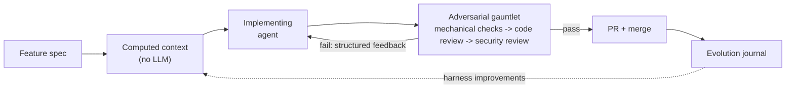
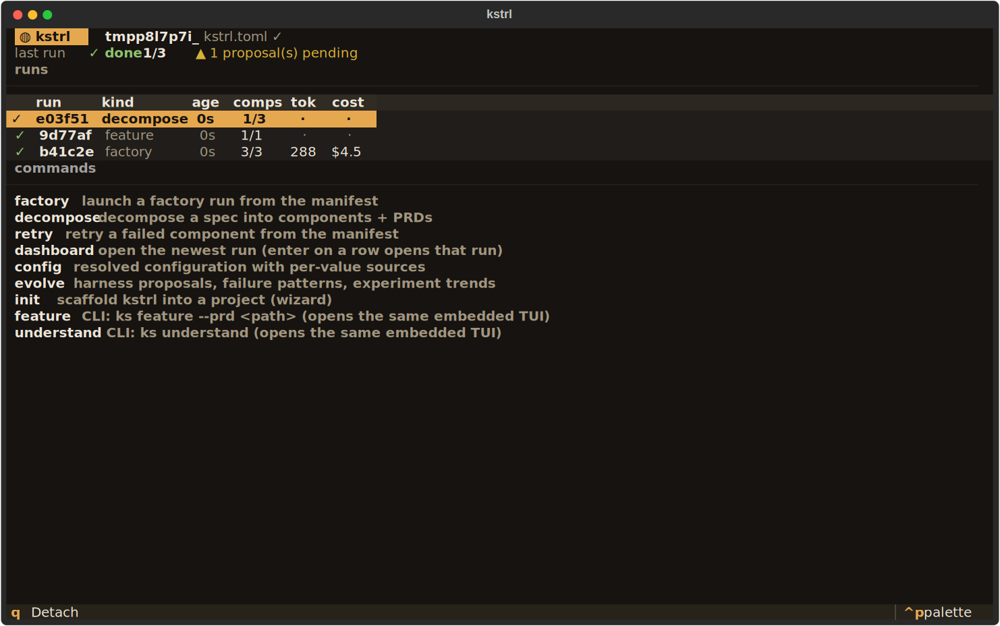

<p align="center">
  <picture>
    <source media="(prefers-color-scheme: dark)" srcset="assets/logo/kstrl-mark-dark.svg">
    
  </picture>
</p>

<h1 align="center">kstrl</h1>

<p align="center"><em>AI agents write the code. kstrl makes sure it actually works.</em></p>

[](https://github.com/0xfauzi/kstrl/actions/workflows/ci.yml)
[](https://pypi.org/project/kstrl/)
[](pyproject.toml)
[](LICENSE)

kstrl (pronounced "kestrel"; formerly Ralph) is a harness for AI coding agents. Like the bird, it hunts by hovering: it holds position over your codebase, watches everything the agent does, and strikes precisely when something is wrong. You hand it a feature spec and walk away. It steers the agent with codebase context, verifies the output with structured checks, retries with actionable feedback, and learns from its mistakes across runs.

The problem it solves: AI coding agents are powerful, but they work on a single prompt at a time. If the agent doesn't finish in one shot, you're back to manually re-prompting, checking progress, and deciding what to try next. And even when the agent says "done," there's no guarantee the code actually works. kstrl automates the outer loop - iteration, verification, and improvement - so the agent produces working code, not just code that claims to work. And because walk-away automation is only trustworthy when you can see what it did, every run streams a typed event log you can watch live in a terminal dashboard, attach to from another terminal, or replay after the fact.

## What makes kstrl different

Most agent wrappers are retry loops: run the agent, check if it's done, retry if not. kstrl applies harness engineering - a combination of feedforward controls (steer the agent before it acts) and feedback sensors (verify after it acts) to systematically increase confidence in agent output.



The gauntlet is the point: independent adversarial reviewers whose job is to distrust the implementing agent - and a harness that distrusts the reviewers too (empty, partial, or oversized reviews fail closed). The full phase-by-phase pipeline, with every diagram this README used to carry, lives in [ARCHITECTURE.md](ARCHITECTURE.md).

**Documentation**: [ARCHITECTURE.md](ARCHITECTURE.md) is the detailed system tour (pipeline, iteration loop, factory scheduling, state layout), [docs/adversarial-design.md](docs/adversarial-design.md) covers the full 8-role taxonomy, [docs/env-vars.md](docs/env-vars.md) every environment variable, [docs/runbook.md](docs/runbook.md) operator failure recovery, and [docs/linear-integration.md](docs/linear-integration.md) the optional Linear mirror. [examples/](examples/) has a scaffolded uv project and two sample feature specs.

## Quick start

Install from PyPI (or from a clone for development):

```bash
uv tool install kstrl              # installs `ks` and `kstrl` (requires Python 3.11+, uv)
# or: git clone https://github.com/0xfauzi/kstrl.git && cd kstrl && uv tool install -e .

cd your-project
ks init .                          # scaffold kstrl.toml and prompt/PRD templates
$EDITOR scripts/kstrl/prd.json     # define what to build (user stories + acceptance criteria)
ks run 25                          # let the agent work for up to 25 iterations
```

Every long-running command opens its live dashboard on a terminal automatically (`--no-tui` opts out), and bare `ks` opens a home shell with a run browser and command launcher; `ks dash` attaches a read-only view to any run - in flight or finished - from another terminal, and `ks status` prints the same state for scripts and CI (and opens the dashboard when you run it interactively).

You need at least one AI coding agent CLI:

| Agent | Install | Example models |
|-------|---------|----------------|
| Claude Code (recommended) | [claude.ai/code](https://claude.ai/code) | `opus`, `sonnet`, `haiku`, `claude-fable-5` |
| OpenAI Codex | [github.com/openai/codex](https://github.com/openai/codex) | `gpt-5.5`, `gpt-5.4` |
| Custom | Any command that reads stdin | - |

Model names current as of 2026-07: the claude aliases track the newest release in each tier (today Opus 4.8, Sonnet 5, Haiku 4.5) with `claude-fable-5` as the top-end frontier model, and codex defaults to `gpt-5.5` (the older `gpt-5.x-codex` ids are being retired).

kstrl does not validate model names: `[agent].model` is passed straight through to the CLI (`claude --model` / `codex -m`), so any model the installed CLI accepts works.

There is also an opt-in in-process adapter, `[agent] type = "claude-sdk"`, that drives Claude through the [Claude Agent SDK](https://docs.claude.com/en/api/agent-sdk/overview) instead of a CLI subprocess and supports an in-loop USD budget ceiling (`[agent].budget_usd`). It requires the `sdk` extra (`uv sync --extra sdk`) and is never chosen by auto-detect.

**Python-first**: kstrl works best on Python projects managed with uv. The feedforward interface and dependency analysis parse Python (`ast` and import statements), and the default verification commands are `uv run pytest` / `uv run mypy` / `uv run ruff check`. Other stacks work by overriding the `[verify]` commands in kstrl.toml, but they get a reduced feedforward context (module map and conventions only).

## How it works

### Before the agent acts: computed context

kstrl statically analyzes the codebase - module map, public interfaces, dependency graph, active conventions - and injects it into the prompt. No LLM calls, no token cost. The agent knows "this project uses httpx, not requests" before it starts, instead of learning it from a linter failure on iteration 3.

### After the agent acts: the gauntlet

When the agent signals completion, kstrl doesn't just trust it. Every run goes through mechanical verification:

- **Mechanical checks** (fast, computational): tests, typecheck, lint, no changes outside allowed paths, no leaked secrets.
- **Adversarial review** (LLM): an independent reviewer checks the diff against the acceptance criteria, then a security reviewer hunts vulnerabilities - in `hard` mode their failures block.
- **Contract testing** (multi-component runs): component branches merge tier-by-tier with integration tests at each tier.

When verification fails, kstrl doesn't dump raw stderr into the retry prompt. It parses tool output into structured failures with file paths, source context, and fix hints. A sample of the retry context the agent gets back after a failed typecheck:

```text
[mypy] Found 1 error in 1 file (checked 14 source files)
  src/api/auth.py:23 [arg-type] Argument 1 to "verify_password" has incompatible type "str | None"; expected "str"
    |     21 |     password = request.form.get("password")
    |     22 |     user = get_user(username)
    | >   23 |     if verify_password(password, user.password_hash):
    |     24 |         return create_token(user)
    hint: Type mismatch in argument - convert or check the value before passing it.
```

### Continuous learning - the harness improves itself

After each factory run, kstrl records structured failure signatures to an evolution journal. Over multiple runs, it identifies recurring patterns and proposes harness improvements - as markdown files for human review, never silent self-modification.


```bash
ks evolve              # analyze recent runs, find patterns
ks evolve --status     # show experiment trends (retry rate over time)
```

If the agent keeps triggering the same linter rule across components, `ks evolve` proposes adding a convention to CLAUDE.md. If typecheck failures recur on Optional types, it proposes a mypy config change. Proposals are written as markdown files for human review.

This is the meta-loop: kstrl doesn't just retry - it learns what causes failures and updates its own controls to prevent them.

## Factory mode - parallel multi-component execution

For large features, kstrl decomposes a spec into independent components and runs them in parallel:

```bash
kstrl decompose --spec features.md --project-name myproject
kstrl factory --manifest scripts/kstrl/manifest.json --max-parallel 4
```

Each component runs in an isolated git worktree (`.kstrl/worktrees/<run>/<component>`) with its own PRD. `ks run` is actually factory mode with a single component - the same verification pipeline runs whether you're building one feature or twenty.

Scheduling, worktree isolation, merge gating, and the contract-testing bisect are diagrammed in [ARCHITECTURE.md](ARCHITECTURE.md#factory-mode).

## Linear integration - the factory, mirrored into your tracker

Enable the mirror and every factory run shows up in Linear without you lifting a finger:

```toml
[linear]
enabled = true
team_id = "your-team-uuid"
```

```bash
export KSTRL_LINEAR_TOKEN="lin_api_..."
```

`ks decompose` creates a project and one issue per component (user stories as a checklist in the issue body); non-blocker spec findings are filed into Triage. Status transitions ride Linear's own GitHub integration: the component branch carries the issue identifier and the PR body carries a `Fixes ENG-42` trailer, so In Progress on PR-open and Done on merge cost kstrl zero API calls. Failures and budget halts land as a comment on the issue, and retries update the same issues - never duplicates, because issue ids persist in the manifest.

The mirror is observability-only by design: every Linear failure warns and degrades, and nothing in the pipeline ever fails because Linear did. Setup, per-team automation settings, and rate-limit behavior: [docs/linear-integration.md](docs/linear-integration.md).

## The TUI - the whole surface, not just the factory

The long-running kstrl surface is available through a terminal UI. Bare `ks` opens the home shell: project identity, a browser over every recorded run of every kind (with folded outcome/token/cost summaries and honest `·` cells while they compute), and a command launcher - factory and decompose launch from forms right there, retry picks a failed component off the manifest, and config, evolve, and the init wizard open as full screens. Non-TTY invocations are byte-identical to before (`ks` prints help, exit 2); `KSTRL_NO_TUI=1` opts out everywhere.



Every long-running command (`ks factory`, `ks run`, `ks retry`, `ks understand`, `ks feature`, `ks decompose`) records a replayable event stream and opens its embedded dashboard on a terminal; plain output remains the default for non-TTY use. The screenshots are real, captured from a live toy-project factory run.

The overview board shows every component's status, authoritative phase, attempt, last-event age, and spend - here with `auth-core` and `api-routes` running in parallel workers while `ui-shell` waits on its dependency:


`enter` drills into a component: phase timeline with verdicts, the typed findings stream with reviewing-model attribution, the live engineer transcript, and evidence paths.

With `pause_before_pr_merge` enabled, the E6 human checkpoint opens as a real inspection surface - the diff excerpt, both finding streams, and what the attempt cost - instead of a y/n prompt. `a` approves, `r` rejects (fails the component and skips dependents), `t` consumes a retry, `escape` leaves it pending while you look around the dashboard:


Keys: `enter` detail, `escape` back, `f` follow transcript, `c` reopen a checkpoint, `q` quit (graceful stop when embedded; a second `q` escalates).

The TUI is a view, never the record: every run appends typed, schema-versioned events to `.kstrl/runs/<run_id>/events.jsonl`, which is why attaching mid-run, replaying a finished run, and surviving a dashboard crash all work by construction ([details](ARCHITECTURE.md#the-event-stream-substrate)). Cost figures are CLI self-reports: any unreported call renders a `+` marker and the total becomes a lower bound - the dashboard never turns an honest number into a false one.

## Approved fixtures - behavioral verification you control

Agent-generated tests can be written to pass trivially. Approved fixtures are input/output pairs, declared in the PRD, that the agent's code must satisfy - they run during Phase 1 mechanical verification, outside the project's own pytest, so a gamed conftest cannot deselect them.

Fixtures are **off by default**. Enable them in kstrl.toml (they also do nothing unless the PRD has a `fixtures` array):

```toml
[fixtures]
enabled = true
```

```json
{
  "branchName": "kstrl/auth",
  "fixtures": [
    {
      "description": "Login returns token",
      "fixture_type": "cli",
      "input_data": {"command": "curl -s localhost:8000/api/login -d '{\"user\":\"test\"}'"},
      "expected": {"exit_code": 0, "stdout_contains": ["token"]}
    }
  ],
  "userStories": [...]
}
```

Three fixture types: `cli` (run a command, check output), `function` (import and call, check return), `file` (check existence and content). Fixture definitions are LLM-emitted and therefore treated as untrusted: commands run without a shell in a scrubbed environment, functions run in a sandboxed subprocess, and file paths cannot escape the worktree - the full security treatment and the snapshot-regression mechanism are in [ARCHITECTURE.md](ARCHITECTURE.md#the-fixtures-sandbox). See the `[fixtures]` keys in the configuration reference below.

## Why not just use Claude Code directly?

You can, and for small tasks you should. kstrl is for when you want to:

- **Define success criteria before starting** - acceptance criteria, path restrictions - not just "make it work"
- **Walk away** - kstrl runs unattended with structured verification, not just a completion marker
- **Watch it without babysitting it** - a live dashboard over a replayable event log; attach, detach, or inspect after the fact
- **Give the agent context** - feedforward injection means fewer wasted iterations discovering the codebase
- **Get structured retries** - parsed failures with source context and fix hints, not raw stderr
- **Build multiple components in parallel** - factory mode with worktree isolation and contract testing
- **Improve over time** - the evolution journal tracks patterns so the same mistakes don't keep recurring
- **Red-team the spec before building** - the architect pass halts on blocker-severity spec ambiguities instead of guessing

## CLI reference

<!-- BEGIN GENERATED: cli-reference -->
<!-- Generated by scripts/gen_docs.py - do not edit by hand. -->

```
ks config show                  Print the fully resolved config with the source of each value.
ks dash                         Live dashboard over a factory run (observe-only).
ks decompose                    Decompose a spec into components and generate PRDs.
ks evolve                       Analyze factory runs and propose harness improvements.
ks factory                      Run the software factory - decompose and execute a spec.
ks feature                      Run feature understanding, then implementation.
ks init [DIRECTORY]             Initialize Ralph in a project directory.
ks retry COMPONENT_ID           Retry a FAILED component from the factory manifest (R3.3).
ks run [MAX_ITERATIONS]         Run the agentic loop as a single-component factory invocation.
ks status                       Show per-component status from the manifest + progress log.
ks understand [MAX_ITERATIONS]  Run codebase understanding loop (read-only mode).
```

Run `ks COMMAND --help` for the full option list of any command.
<!-- END GENERATED: cli-reference -->

## Configuration

kstrl reads `kstrl.toml` at the project root; copy [kstrl.toml.example](kstrl.toml.example) to start. Precedence: CLI flags > environment variables > kstrl.toml > dataclass defaults. `ks config show` prints the fully resolved config with the source of each value.

<!-- BEGIN GENERATED: config-reference -->
<!-- Generated by scripts/gen_docs.py - do not edit by hand. -->
<!-- Defaults come from the config dataclasses; every key is probed
     against the real loaders before this section is emitted. -->

```toml
# Agent selection
[agent]
type = ""              # "claude-code" | "claude-sdk" | "codex"; empty/"auto" = auto-detect
command = ""           # custom agent shell command; overrides type
model = ""             # e.g. "sonnet" (claude) or "gpt-5.5" (codex); empty = agent default
reasoning_effort = ""  # low | medium | high | max (model-dependent)
budget_usd = ""        # in-loop USD ceiling; claude-sdk adapter only; empty/0 = unlimited (R7.6)

# Loop behavior
[run]
max_iterations = 10  # iteration budget per component
sleep_seconds = 2.0  # pause between iterations
interactive = false  # human-in-the-loop mode for the legacy loop

# File locations
[paths]
prompt = "scripts/kstrl/prompt.md"              # engineer prompt file
prd = "scripts/kstrl/prd.json"                  # PRD file
progress = "scripts/kstrl/progress.txt"         # progress log the agent appends to
codebase_map = "scripts/kstrl/codebase_map.md"  # brownfield codebase notes
allowed = []                                    # diff-scope allowlist, e.g. ["src/", "tests/"]; empty = unrestricted

# Branch handling
[git]
branch = ""           # branch override; empty = use PRD branchName
auto_checkout = true  # check the branch out automatically

# Output rendering
[ui]
ascii = false  # ASCII separators only (no box-drawing characters)

# Timeout limits (seconds; 0 or less disables)
[timeout]
git_operation = 30.0              # per git subprocess
agent_iteration = 1800.0          # one engineer iteration
component_total = 7200.0          # wall clock per component across iterations
verification_check = 300.0        # each Phase 1 check subprocess
review_agent = 600.0              # Phase 2 reviewer call
contract_test = 600.0             # Phase 3 contract test run
subprocess_default = 60.0         # any other subprocess
scheduler_backstop_margin = 60.0  # extra slack before the scheduler declares a worker dead

# Factory orchestration (Phase 0-3 pipeline)
[factory]
max_parallel = 4                   # concurrent component workers
max_retries = 3                    # per-component retry budget across all phases
retry_delay = 5.0                  # seconds between retry attempts
use_worktrees = true               # isolate each component in .kstrl/worktrees/<run>/<id>
single_pr = false                  # one PR for the whole run instead of per-component
create_prs = true                  # push + merge PRs via gh
review_mode = "hard"               # hard | advisory | skip (Phase 2)
merge_timeout = 300.0              # seconds to wait for PR merge confirmation
max_adversarial_calls = 0          # cap on review+security+distill LLM calls; 0 = unbounded
max_total_tokens = 0               # run-level token budget; 0 = unbounded
pause_before_pr_merge = false      # human checkpoint before each PR (E6)
progress_log_enabled = true        # JSONL event log at .kstrl/progress.jsonl (R3.2)
keep_worktrees_on_failure = false  # keep failed components' worktrees for post-mortem (R3.3)

# No-progress circuit breaker (R7.5; 0 iterations disables)
[breaker]
no_progress_iterations = 3  # halt after N consecutive no-progress iterations; 0 disables (R7.5)
test_command = ""           # stall-probe command; empty = the explicit [verify] test_command, else diff-hash only
test_timeout = 300.0        # seconds before the stall probe is killed

# OS-level agent sandboxing (R7.5; claude-code/codex only)
[sandbox]
enabled = false        # OS-sandbox the engineer's agent CLI (writes scoped to its worktree); ignored for custom agent commands
allow_network = false  # re-open outbound network inside the sandbox (off = deny)

# Phase 1 mechanical verification
[verify]
test_command = ""                                  # empty = smart default (uv run pytest)
typecheck_command = ""                             # empty = smart default (uv run mypy)
lint_command = ""                                  # empty = smart default (uv run ruff check)
check_diff_scope = true                            # fail on changes outside allowed paths
check_bad_patterns = true                          # scan the diff for secret-like patterns
dead_code_cleanup = false                          # optional dead-code check
dead_code_command = ""                             # empty = smart default when dead_code_cleanup is on
mutation_testing = false                           # optional mutation testing
mutation_threshold = 50.0                          # minimum mutation kill rate (percent)
mutation_timeout = 600.0                           # seconds for the mutation run
subprocess_timeout = 300.0                         # seconds per verification subprocess
require_self_critique = false                      # fail Phase 1 if the ## Self-Critique block is missing/sparse
self_critique_min_bullets = 3                      # minimum substantive bullets in the block
progress_file_path = "scripts/kstrl/progress.txt"  # progress file the self-critique check reads

# Phase 1 approved-fixtures oracle (R7.2; default off)
[fixtures]
enabled = false                    # run PRD-defined fixtures during Phase 1 (sandboxed; opt-in)
snapshot_on_success = true         # save passing outputs for cross-run regression comparison
snapshot_dir = ".kstrl/snapshots"  # relative paths resolve against the repo root
timeout = 30.0                     # seconds per fixture subprocess

# Phase 2.5 security review
[security]
mode = "skip"            # skip | advisory | hard
agent_cmd = ""           # empty = inherit [agent]
agent_type = ""          # empty = inherit [agent]
model = ""               # empty = inherit [agent]
timeout_seconds = 600.0  # reviewer call timeout
fail_threshold = "high"  # critical | high | medium | low (hard mode)

# Phase 3 cross-component contract testing
[contract]
mode = "tier"                   # tier | final | skip
test_command = "uv run pytest"  # integration test command on merged tiers
timeout = 600.0                 # seconds per contract test run

# Phase 0 feedforward (computational, no LLM)
[feedforward]
enabled = true             # inject structural context into the prompt
module_map = true          # directory tree with LOC counts
public_interfaces = true   # public symbols via Python ast
dependency_graph = true    # internal import analysis (Python only)
conventions = true         # extract from pyproject.toml, ruff.toml, ...
max_context_tokens = 4000  # cap to avoid prompt bloat

# Per-component knowledge layer
[knowledge]
enabled = true                   # distill + inject durable facts
max_core_tokens = 2000           # current component's facts (full text)
max_dependency_tokens = 1000     # dependency facts (full text)
max_sibling_tokens = 500         # other components' facts (first sentence)
distill_timeout_seconds = 300.0  # distiller call timeout
distill_model = ""               # empty = falls back to [agent].model
max_facts_per_distill = 7        # cap on facts written per component
dependency_scope = "direct"      # direct | transitive (E8)

# Continuous-learning journal
[evolution]
enabled = true                               # record run outcomes
journal_path = ".kstrl/evolution.jsonl"      # JSONL journal location
experiments_path = ".kstrl/experiments.tsv"  # experiment tracker location
min_pattern_frequency = 2                    # pattern must recur N times before proposal
lookback_runs = 10                           # past runs to analyze
auto_propose = true                          # generate proposals after each factory run
auto_apply_computational = false             # auto-apply computational proposals

# Run-milestone notification hooks (R3.2)
[notify]
on_complete = ""       # shell hook fired once when the run finishes; empty = disabled
on_first_failure = ""  # shell hook fired once on the first component failure
hook_timeout = 30.0    # seconds before a hook command is killed

# Linear integration (R7.4; default off)
[linear]
enabled = false                             # mirror runs into Linear (project/issues/status via GitHub linking)
team_id = ""                                # Linear team UUID (required when enabled)
token_env = "KSTRL_LINEAR_TOKEN"            # NAME of the env var holding the API token
auth_mode = "auto"                          # auto | api_key | oauth (auto sniffs the lin_api_ prefix)
api_url = "https://api.linear.app/graphql"  # GraphQL endpoint
dry_run = false                             # record mutations instead of sending them
timeout_seconds = 30.0                      # per-request timeout
min_request_interval = 0.5                  # client-side throttle between requests (seconds)
```

Environment variables override kstrl.toml, and CLI flags override both.
See [docs/env-vars.md](docs/env-vars.md) for the full env-var mapping.
<!-- END GENERATED: config-reference -->

## The PRD

The PRD (`prd.json`) is a list of user stories with testable acceptance criteria:

```json
{
  "branchName": "kstrl/login-feature",
  "allowedPaths": ["src/", "tests/"],
  "userStories": [
    {
      "id": "US-001",
      "title": "User can log in with email",
      "acceptanceCriteria": [
        "Login form accepts email and password",
        "Invalid credentials show error message",
        "Tests pass: uv run pytest tests/test_auth.py"
      ],
      "priority": 1,
      "passes": false,
      "notes": ""
    }
  ]
}
```

The agent updates `passes` and `notes` as it works. kstrl reads these between iterations to decide whether to continue. Acceptance criteria should be concrete and testable - commands the agent can run, behavior it can verify.

`allowedPaths` is optional for a hand-written PRD (it feeds the Phase 1 diff-scope check); the architect is required to emit it for every decomposed component.

## Architecture

The detailed system tour - full pipeline diagram, iteration lifecycle, factory scheduling, the event-stream substrate, runtime state layout, and the fixtures sandbox - lives in [ARCHITECTURE.md](ARCHITECTURE.md). The adversarial role taxonomy and design invariants are in [docs/adversarial-design.md](docs/adversarial-design.md).

## Development

```bash
git clone https://github.com/0xfauzi/kstrl.git
cd kstrl
uv sync
uv tool install -e .
uv run pytest tests/           # 1777 tests collected at the time of writing (2026-07)
uv run mypy kstrl/ --strict
uv run ruff check kstrl/ tests/
```

The CLI reference and config reference sections of this README are generated: edit the source (click commands / config dataclasses) or `scripts/gen_docs.py`, then run `uv run python scripts/gen_docs.py`. CI fails if the generated sections are stale.

## Contributing

Contributions are welcome, including AI-assisted ones - but AI-generated code is never gated by AI self-review, so every change is reviewed by a human and PRs should declare whether an agent wrote them. Start with [CONTRIBUTING.md](CONTRIBUTING.md) for the setup, the process rules, and how to pick up roadmap work; the [project wiki](https://github.com/0xfauzi/kstrl/wiki) covers the vision, architecture, and roadmap in depth. To report a vulnerability, see [SECURITY.md](SECURITY.md). Release history is in [CHANGELOG.md](CHANGELOG.md).

## License

MIT
