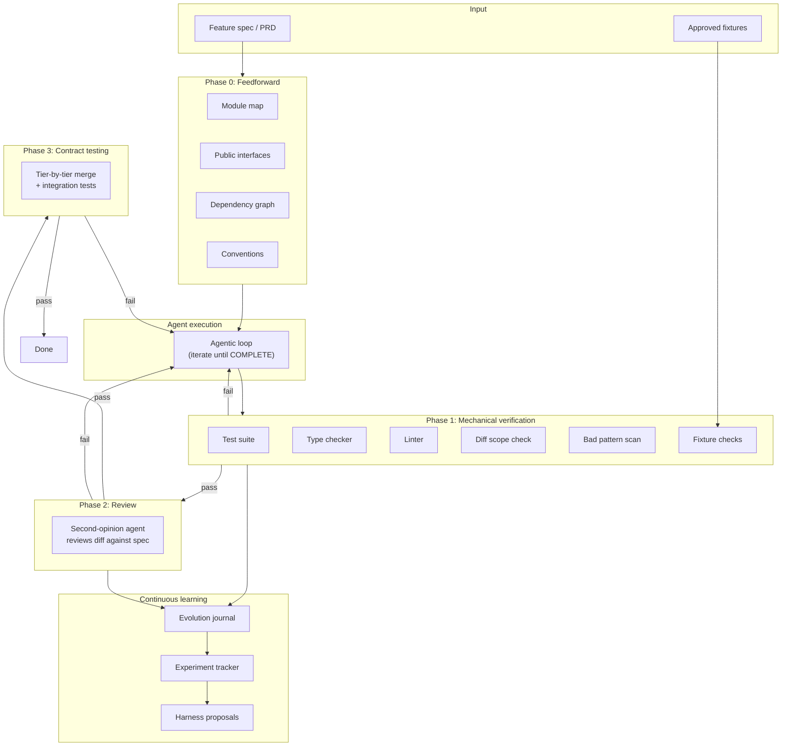

# Ralph

Ralph is a harness for AI coding agents. You hand it a feature spec and walk away. It steers the agent with codebase context, verifies the output with structured checks, retries with actionable feedback, and learns from its mistakes across runs.

The problem it solves: AI coding agents are powerful, but they work on a single prompt at a time. If the agent doesn't finish in one shot, you're back to manually re-prompting, checking progress, and deciding what to try next. And even when the agent says "done," there's no guarantee the code actually works. Ralph automates the outer loop - iteration, verification, and improvement - so the agent produces working code, not just code that claims to work.

## What makes ralph different

Most agent wrappers are retry loops: run the agent, check if it's done, retry if not. Ralph applies harness engineering - a combination of feedforward controls (steer the agent before it acts) and feedback sensors (verify after it acts) to systematically increase confidence in agent output.

```
                        Feedforward (Phase 0)
                        Codebase structure, conventions,
                        dependency graph, scaffolding
                                |
                                v
PRD + Prompt  ------>  [ AI Coding Agent ]  ------->  Output
                                |
                                v
                        Feedback (Phases 1-3)
                        Tests, typecheck, lint, review,
                        contract testing
                                |
                          pass? |
                         /      \
                       yes       no
                        |         |
                      Done    Structured retry context
                              with source lines, fix hints
                                |
                                v
                        [ Evolution Journal ]
                        Track patterns across runs,
                        propose harness improvements
```

## Quick start

```bash
uv tool install ralph-cli          # install (requires Python 3.11+, uv)
cd your-project
ralph init .                       # scaffold config and prompt templates
ralph prd create                   # define what to build
ralph run 25                       # let the agent work for up to 25 iterations
```

You need at least one AI coding agent CLI:

| Agent | Install | Models |
|-------|---------|--------|
| Claude Code (recommended) | [claude.ai/code](https://claude.ai/code) | sonnet, opus, haiku |
| OpenAI Codex | [github.com/openai/codex](https://github.com/openai/codex) | o3, o4-mini |
| Custom | Any command that reads stdin | - |

## How it works

### Phase 0: Feedforward - give the agent context before it starts

Before the agent writes a single line, ralph computationally analyzes the codebase and injects structural context into the prompt. No LLM calls, no token cost - pure static analysis:

- **Module map** - directory tree with file counts and lines of code
- **Public interfaces** - classes and function signatures extracted via Python's `ast` module
- **Dependency graph** - internal import relationships between modules
- **Active conventions** - line length, quote style, type checking mode from pyproject.toml, ruff.toml, .editorconfig

This reduces wasted iterations. The agent knows "this project uses httpx, not requests" before it starts, instead of learning it from a linter failure on iteration 3.

### Phases 1-3: Verification - check the output, not just the completion marker

When the agent signals completion, ralph doesn't just trust it. Every run goes through mechanical verification:

**Phase 1 - Mechanical checks** (computational, fast):
- Test suite passes
- Type checker passes
- Linter passes
- No changes outside allowed paths
- No leaked secrets or syntax errors
- Optional: mutation testing

**Phase 2 - Second-opinion review** (inferential, LLM-based):
- A separate agent reviews the diff against the acceptance criteria
- Modes: `hard` (failures block), `advisory` (warn only), `skip`

**Phase 3 - Contract testing** (for multi-component runs):
- Merges component branches tier-by-tier
- Runs integration tests at each tier
- Bisects to identify which component broke integration

When verification fails, ralph doesn't dump raw stderr into the retry prompt. It parses tool output into structured failures with file paths, source context, and fix hints:

```
1. src/api/auth.py:23
   error: Argument 1 to "verify_password" has incompatible type "str | None"

   21 |     password = request.form.get("password")
   22 |     user = get_user(username)
 > 23 |     if verify_password(password, user.password_hash):
   24 |         return create_token(user)

   FIX: Add a None check before calling verify_password, or provide a default value.
```

### Continuous learning - the harness improves itself

After each factory run, ralph records outcomes to an evolution journal. Over multiple runs, it identifies recurring failure patterns and proposes harness improvements:

```bash
ralph evolve              # analyze recent runs, find patterns
ralph evolve --status     # show experiment trends (retry rate over time)
```

If the agent keeps triggering the same linter rule across components, `ralph evolve` proposes adding a convention to CLAUDE.md. If typecheck failures recur on Optional types, it proposes a mypy config change. Proposals are written as markdown files for human review.

This is the meta-loop: ralph doesn't just retry - it learns what causes failures and updates its own controls to prevent them.

## Factory mode - parallel multi-component execution

For large features, ralph decomposes a spec into independent components and runs them in parallel:

```bash
ralph decompose --spec features.md --project-name myproject
ralph factory --manifest scripts/ralph/manifest.json --max-parallel 4
```

Each component runs in an isolated git worktree with its own PRD. The factory orchestrator:

1. Validates the component DAG (topological sort, cycle detection)
2. Schedules components respecting dependency order
3. Runs each through the full Phase 0-2 pipeline
4. Creates and merges PRs automatically
5. Runs contract tests across merged tiers
6. Retries failed components with accumulated context

`ralph run` is actually factory mode with a single component. The same verification pipeline runs whether you're building one feature or twenty.

## Approved fixtures - behavioral verification you control

Agent-generated tests can be written to pass trivially. Approved fixtures are human-written input/output pairs that the agent's code must satisfy:

```json
{
  "branchName": "ralph/auth",
  "fixtures": [
    {
      "description": "Login returns token",
      "fixture_type": "cli",
      "input_data": {"command": "curl -s localhost:8000/api/login -d '{\"user\":\"test\"}'"},
      "expected": {"exit_code": 0, "stdout_contains": ["token"]}
    },
    {
      "description": "Config is importable",
      "fixture_type": "function",
      "input_data": {"module": "src.config", "function": "get_settings", "args": []},
      "expected": {"returns": {"debug": false}}
    },
    {
      "description": "Migration file exists",
      "fixture_type": "file",
      "input_data": {"path": "migrations/001_users.sql"},
      "expected": {"exists": true, "contains": ["CREATE TABLE users"]}
    }
  ],
  "userStories": [...]
}
```

Three fixture types: `cli` (run a command, check output), `function` (import and call, check return), `file` (check existence and content). Fixtures run during Phase 1 alongside tests and typecheck. Snapshot regression detects when a previously-passing fixture breaks.

## Why not just use Claude Code directly?

You can, and for small tasks you should. Ralph is for when you want to:

- **Define success criteria before starting** - acceptance criteria, golden fixtures, path restrictions - not just "make it work"
- **Walk away** - Ralph runs unattended with structured verification, not just a completion marker
- **Give the agent context** - feedforward injection means fewer wasted iterations discovering the codebase
- **Get structured retries** - parsed failures with source context and fix hints, not raw stderr
- **Build multiple components in parallel** - factory mode with worktree isolation and contract testing
- **Improve over time** - the evolution journal tracks patterns so the same mistakes don't keep recurring
- **Plan before building** - interactive mode stress-tests your spec with an AI PM before any code is written

## CLI reference

```
ralph                         Launch TUI
ralph init [DIR]              Set up Ralph in a project
ralph run [N]                 Run with verification (factory pipeline)
ralph run [N] --no-verify     Run without verification (faster, less safe)
ralph run [N] --legacy        Run with old direct loop (no factory)
ralph understand [N]          Run read-only codebase mapping
ralph feature                 Two-phase: understand then implement
ralph decompose --spec FILE   Decompose spec into component DAG
ralph factory                 Run multi-component factory
ralph evolve                  Analyze runs, propose harness improvements
ralph evolve --status         Show experiment trends
ralph prd create              PRD creation wizard
ralph prd import FILE         Generate PRD from a spec document
ralph prd validate            Check prd.json schema
ralph config show             Print current config
ralph status                  Project overview
```

## Configuration

Ralph uses `ralph.toml` at the project root:

```toml
[agent]
type = "claude"               # "claude", "codex", or "custom"
model = ""                    # model override
command = ""                  # shell command for custom agents

[run]
max_iterations = 10
sleep_seconds = 2
interactive = false

[paths]
allowed = []                  # restrict which files the agent can change

[git]
branch = ""                   # override branch (empty = use PRD)
auto_checkout = true

# Feedforward controls (Phase 0)
[feedforward]
enabled = true
module_map = true             # directory tree with LOC counts
public_interfaces = true      # extract public symbols via ast
dependency_graph = true       # internal import analysis
conventions = true            # extract from pyproject.toml, ruff.toml, etc.
max_context_tokens = 4000     # cap to avoid prompt bloat

# Sensor output optimization
[sensors]
parse_output = true           # structured parsing of test/lint output
include_source_context = true # include source lines around failures
max_failures_per_check = 10   # cap failures per check in retry context

# Continuous learning
[evolution]
enabled = true
journal_path = ".ralph/evolution.jsonl"
experiments_path = ".ralph/experiments.tsv"
min_pattern_frequency = 2     # pattern must recur N times before proposal
lookback_runs = 10            # how many past runs to analyze
auto_propose = true           # generate proposals after each factory run

# Approved fixtures
[fixtures]
enabled = false               # opt-in
snapshot_on_success = true    # auto-snapshot outputs after verification pass
snapshot_dir = ".ralph/snapshots"
```

Environment variables override ralph.toml: `AGENT_CMD`, `MODEL`, `INTERACTIVE`, `SLEEP_SECONDS`, `ALLOWED_PATHS`, `RALPH_BRANCH`.

## The PRD

The PRD (`prd.json`) is a list of user stories with testable acceptance criteria:

```json
{
  "branchName": "ralph/login-feature",
  "userStories": [
    {
      "id": "US-001",
      "title": "User can log in with email",
      "acceptanceCriteria": [
        "Login form accepts email and password",
        "Invalid credentials show error message",
        "Tests pass: uv run pytest tests/test_auth.py"
      ],
      "priority": 1,
      "passes": false,
      "notes": ""
    }
  ]
}
```

The agent updates `passes` and `notes` as it works. Ralph reads these between iterations to decide whether to continue. Acceptance criteria should be concrete and testable - commands the agent can run, behavior it can verify.

Optionally, add a `fixtures` array for behavioral verification (see [Approved fixtures](#approved-fixtures---behavioral-verification-you-control)).

## Architecture



For multi-component factory runs, each component goes through this pipeline independently in parallel git worktrees, with contract testing merging them tier-by-tier after individual verification.

## Development

```bash
git clone https://github.com/0xfauzi/ralph-loop.git
cd ralph-loop
uv sync
uv tool install -e .
uv run pytest                  # 333 tests
```

## License

MIT
