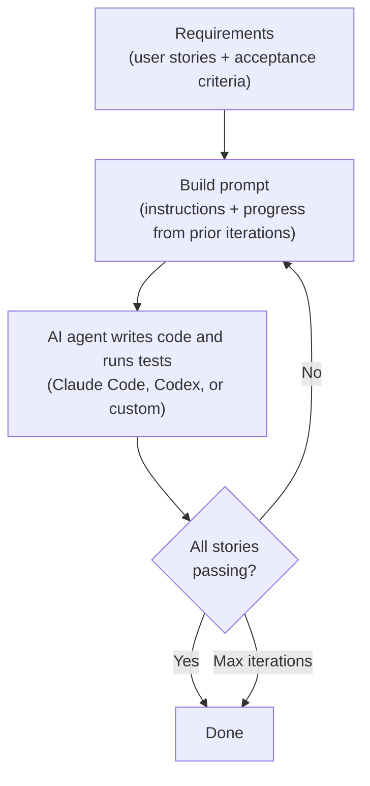
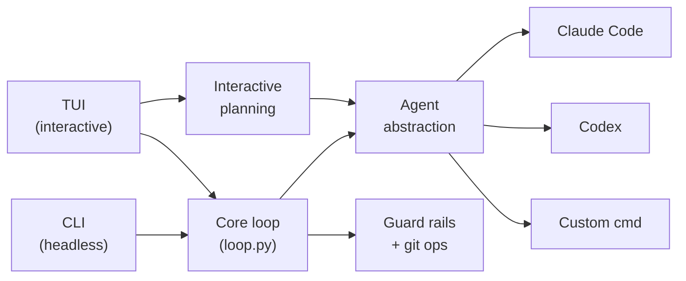

# Ralph

Ralph lets you hand a feature spec to an AI coding agent and walk away. It runs the agent in a loop - writing code, running tests, checking results - and keeps going until every requirement passes or it hits a retry limit.

The problem it solves: AI coding agents like Claude Code and Codex are powerful, but they work on a single prompt at a time. If the agent doesn't finish in one shot, you're back to manually re-prompting, checking progress, and deciding what to try next. Ralph automates that outer loop. You define the requirements up front as testable acceptance criteria, and Ralph handles the iteration, progress tracking, and guardrails.

## What a session looks like

You start with an idea. Ralph helps you turn it into a structured spec, then drives an agent to implement it:

```
$ ralph init .                         # scaffold ralph config in your project
$ ralph prd create                     # define what you want to build
$ ralph run 25 --agent claude          # let the agent work for up to 25 iterations
```

Behind the scenes, each iteration:

1. Ralph reads your requirements (a JSON file of user stories with acceptance criteria)
2. It builds a prompt that includes the requirements, the agent's instructions, and a log of what happened in previous iterations
3. It sends the prompt to the agent, which writes code, runs tests, and reports back
4. Ralph checks whether the agent signaled completion and whether any file changes violated path restrictions
5. If stories remain incomplete, it loops back to step 2 with updated context

The loop exits when the agent marks all stories as passing, or when the iteration limit is reached.



## Why not just use Claude Code directly?

You can, and for small tasks you should. Ralph is for when you want to:

- **Define success criteria before starting** - "tests pass, types check, login form works" - and have the agent keep trying until they're met
- **Walk away** - Ralph runs unattended. You come back to a branch with the work done (or a progress log showing what was attempted)
- **Constrain the agent** - restrict which files it can touch, automatically revert out-of-scope changes
- **Track progress across iterations** - each run builds on the last, with full context injection so the agent knows what it already tried
- **Plan before building** - Ralph's interactive mode lets you have a conversation with an AI PM that stress-tests your spec before any code is written

## Installation

Requires Python 3.11+ and [uv](https://docs.astral.sh/uv/).

```bash
uv tool install ralph-cli
```

You also need at least one AI coding agent CLI:

| Agent | Install | Models |
|-------|---------|--------|
| Claude Code (recommended) | [claude.ai/code](https://claude.ai/code) | sonnet, opus, haiku |
| OpenAI Codex | [github.com/openai/codex](https://github.com/openai/codex) | o3, o4-mini |
| Custom | Any command that reads stdin | - |

## Quick start

### 1. Set up

```bash
cd your-project
ralph init .
```

This creates `ralph.toml` (configuration) and `scripts/ralph/` (prompt templates, progress log). Ralph auto-detects which agent CLIs you have installed.

### 2. Define what to build

Three options depending on how fleshed out your idea is:

**You have a rough idea** - talk it through with an AI PM first:
```bash
ralph                    # launch TUI, select "Interactive Feature"
```
Ralph starts a conversation where an AI reviewer asks probing questions from product, engineering, and reliability perspectives. When the spec is tight enough, it generates a structured PRD automatically.

**You have a spec document** - import and convert it:
```bash
ralph prd import spec.md --agent claude
```

**You want to define stories manually** - use the step-by-step wizard:
```bash
ralph prd create
```

All three produce the same output: a `prd.json` file with user stories, acceptance criteria, priorities, and a branch name.

### 3. Run

```bash
ralph run 25
```

Ralph checks out (or creates) the branch from the PRD, then starts iterating. You'll see the agent reading files, writing code, running tests. Progress is logged between iterations so each run builds on the last.

```bash
ralph run                  # 10 iterations (default)
ralph run 50 --model opus  # 50 iterations with a specific model
ralph run --interactive    # pause after each iteration for review
```

### 4. (Optional) Understand an unfamiliar codebase first

Before building features on a codebase you don't know well:

```bash
ralph understand 10
```

This runs the agent in read-only mode for 10 iterations, producing `scripts/ralph/codebase_map.md` - an evidence-based document about the architecture, patterns, and conventions. The agent reads but does not modify source files.

## Features

- **Autonomous iteration** - runs the agent in a loop until acceptance criteria pass, with progress context injected between iterations
- **Interactive feature planning** - AI PM conversation that stress-tests your spec before generating a PRD
- **Codebase understanding** - read-only mode that maps architecture before you start building
- **Guard rails** - path restrictions auto-revert out-of-scope changes; infrastructure files are protected; 3 consecutive errors trigger bail-out
- **Git integration** - auto branch creation/checkout, change tracking, per-iteration reversion of disallowed files
- **Multi-agent** - Claude Code (streaming with classified output), OpenAI Codex, or any stdin/stdout command
- **Terminal UI** - live dashboard with agent output and story progress, PRD wizard, config editor, status view
- **Headless CLI** - every TUI feature available as a command for scripting and CI

## Terminal UI

```bash
ralph                    # launch TUI
```

| Screen | What it does |
|--------|-------------|
| Run dashboard | Live agent output alongside story progress table. `p` pause, `s` stop |
| Interactive feature | Chat with an AI PM to refine your spec and generate a PRD |
| PRD wizard | Step-by-step story creation form |
| Config | Visual editor for ralph.toml |
| Status | Project overview with story table |

## CLI reference

```
ralph                     Launch TUI
ralph init [DIR]          Set up Ralph in a project
ralph run [N]             Run the agent loop (N = max iterations, default 10)
ralph understand [N]      Run read-only codebase mapping
ralph prd create          PRD creation wizard
ralph prd import FILE     Generate PRD from a spec document
ralph prd validate        Check prd.json schema
ralph prd status          Story summary table
ralph config show         Print current config
ralph config init         Create ralph.toml with defaults
ralph status              Project overview
```

## Configuration

Ralph uses `ralph.toml` at the project root:

```toml
[agent]
type = "claude"           # "claude", "codex", or "custom"
model = ""                # model override (empty = agent default)
command = ""              # shell command for custom agents

[run]
max_iterations = 10
sleep_seconds = 2
interactive = false

[paths]
allowed = []              # restrict which files the agent can change

[git]
branch = ""               # override branch (empty = use PRD branch name)
auto_checkout = true
```

Environment variables override ralph.toml: `AGENT_CMD`, `MODEL`, `INTERACTIVE`, `SLEEP_SECONDS`, `ALLOWED_PATHS`, `RALPH_BRANCH`.

## How the PRD works

The PRD (`prd.json`) is a list of user stories with testable acceptance criteria:

```json
{
  "branchName": "ralph/login-feature",
  "userStories": [
    {
      "id": "US-001",
      "title": "User can log in with email",
      "acceptanceCriteria": [
        "Login form accepts email and password",
        "Invalid credentials show error message",
        "Tests pass: uv run pytest tests/test_auth.py"
      ],
      "priority": 1,
      "passes": false,
      "notes": ""
    }
  ]
}
```

The agent updates `passes` and `notes` as it works. Ralph reads these between iterations to decide whether to continue or stop. Acceptance criteria should be concrete and testable - commands the agent can run, behavior it can verify.

## Architecture



The core loop is decoupled from the interface via a callback protocol. Both CLI and TUI implement the same protocol, so the loop works identically in both modes.

## Development

```bash
git clone https://github.com/0xfauzi/ralph-loop.git
cd ralph-loop
uv sync
uv tool install -e .
uv run pytest
```

## License

MIT
