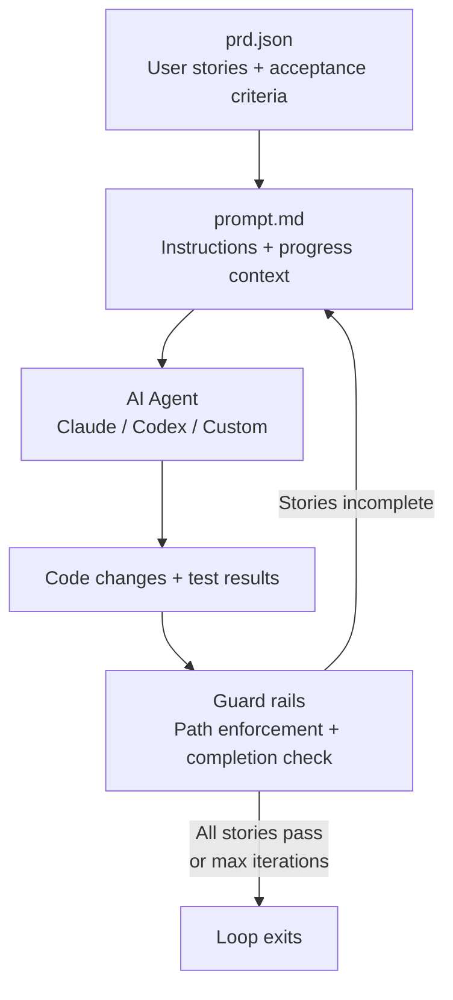
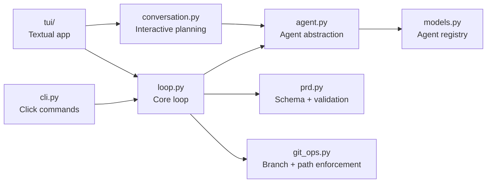

# Ralph

Ralph is an agentic loop harness for autonomous AI-driven development. It runs an AI coding agent in a loop against a set of user stories, iterating until every acceptance criterion passes or a maximum iteration count is reached.

You define what to build. Ralph drives the agent until it's done.

## Features

- **Autonomous iteration loop** - runs an AI coding agent repeatedly against a PRD until all acceptance criteria pass, with automatic progress tracking between iterations
- **Multi-agent support** - works with Claude Code, OpenAI Codex, or any custom command that reads stdin and writes stdout
- **Interactive feature planning** - conversation with an AI PM agent that reviews your spec from product, engineering, and reliability perspectives before generating a structured PRD
- **Codebase understanding mode** - read-only mapping pass that produces an evidence-based architecture document before you start building
- **Guard rails** - path restrictions that automatically revert changes outside allowed directories, with infrastructure file protection
- **Git integration** - automatic branch creation/checkout from PRD, change tracking, and disallowed file reversion per iteration
- **Real-time streaming** - classified output display (AI text, thinking, tool calls, git operations) with role-based visual hierarchy
- **Terminal UI and CLI** - full interactive TUI with live dashboard, PRD wizard, config editor, and status views, plus headless CLI for scripting and CI
- **PRD-driven workflow** - three paths to create a PRD: step-by-step wizard, import from markdown spec, or AI-assisted interactive planning
- **Configuration layering** - settings resolved from CLI flags, environment variables, and ralph.toml with clear precedence

## How it works



Each iteration: Ralph builds a prompt from the PRD and progress log, sends it to the agent, streams the output, checks for the completion marker (`<promise>COMPLETE</promise>`), enforces path restrictions, and logs results.

## Installation

Requires Python 3.11+ and [uv](https://docs.astral.sh/uv/).

```bash
uv tool install ralph-cli
```

For development:

```bash
git clone https://github.com/0xfauzi/ralph-loop.git
cd ralph-loop
uv sync
uv tool install -e .
```

Verify the install:

```bash
ralph --help
```

## Prerequisites

Ralph needs an AI coding agent CLI installed:

| Agent | Command | Models |
|-------|---------|--------|
| Claude Code (recommended) | `claude` | sonnet, opus, haiku |
| OpenAI Codex | `codex` | o3, o4-mini, codex-mini-latest |
| Custom | Any command that reads stdin | - |

Git is optional but recommended for branch management and path enforcement.

## Quick start

### 1. Initialize a project

```bash
ralph init /path/to/your/project
```

This scaffolds `scripts/ralph/` with template files and creates `ralph.toml` with auto-detected agent settings.

### 2. Create a PRD

Three ways to create a PRD:

**Interactive wizard** - step-by-step form:
```bash
ralph prd create
```

**Import from spec** - generate from an existing markdown spec:
```bash
ralph prd import my-spec.md --agent claude
```

**Interactive planning** - conversation with an AI PM that asks probing questions, then generates a PRD:
```bash
ralph
# Select "Interactive Feature" from the menu
```

### 3. Run the loop

```bash
ralph run 25 --agent claude --model sonnet
```

Ralph creates or checks out the branch from the PRD, builds the prompt, and starts iterating. The agent writes code, runs tests, and Ralph tracks progress.

```bash
ralph run              # Default: 10 iterations
ralph run 50           # 50 iterations
ralph run --interactive  # Pause after each iteration
```

### 4. Understand a codebase

Before implementing features on an unfamiliar codebase, run a read-only mapping pass:

```bash
ralph understand 10
```

This produces `scripts/ralph/codebase_map.md` with evidence-based findings about the architecture, patterns, and conventions. The agent reads but does not modify source files.

## Terminal UI

Running `ralph` with no arguments launches the interactive TUI:

```bash
ralph
```

| Screen | Purpose |
|--------|---------|
| Main menu | Mode selection and project status |
| Run dashboard | Live agent output with story progress table. `p` to pause, `s` to stop |
| Interactive feature | Conversation with an AI PM that reviews your spec and generates a PRD |
| PRD wizard | Step-by-step PRD creation form |
| Config | Visual editor for ralph.toml settings |
| Status | Read-only project overview with story table |
| Init wizard | Guided project setup |

## CLI reference

```
ralph                     Launch interactive TUI
ralph init [DIR]          Initialize project scaffolding
ralph run [N]             Run feature loop (N = max iterations)
ralph understand [N]      Run codebase understanding loop (read-only)
ralph prd create          Interactive PRD creation wizard
ralph prd import FILE     Generate PRD from spec via LLM
ralph prd validate        Validate prd.json schema
ralph prd status          Show story summary table
ralph config show         Show current configuration
ralph config init         Create ralph.toml with defaults
ralph status              Project status overview
```

## Configuration

Ralph uses `ralph.toml` at the project root. Create one with defaults:

```bash
ralph config init
```

### Settings

```toml
[agent]
type = "claude"           # "claude", "codex", or "custom"
model = ""                # Model override (empty = agent default)
command = ""              # Custom shell command (type = "custom" only)

[run]
max_iterations = 10
sleep_seconds = 2
interactive = false       # Pause after each iteration

[paths]
prompt = "scripts/ralph/prompt.md"
prd = "scripts/ralph/prd.json"
progress = "scripts/ralph/progress.txt"
codebase_map = "scripts/ralph/codebase_map.md"
allowed = []              # Guard rail: restrict which files agent can change

[git]
branch = ""               # Override branch (empty = use PRD branchName)
auto_checkout = true
```

### Environment variable overrides

Environment variables take precedence over ralph.toml:

| Variable | Setting |
|----------|---------|
| `AGENT_CMD` | `agent.command` (also sets type = custom) |
| `MODEL` | `agent.model` |
| `INTERACTIVE` | `run.interactive` |
| `SLEEP_SECONDS` | `run.sleep_seconds` |
| `ALLOWED_PATHS` | `paths.allowed` (comma-separated) |
| `RALPH_BRANCH` | `git.branch` |

## PRD format

The PRD is a JSON file defining user stories with testable acceptance criteria:

```json
{
  "branchName": "ralph/my-feature",
  "userStories": [
    {
      "id": "US-001",
      "title": "User can log in with email",
      "acceptanceCriteria": [
        "Login form accepts email and password",
        "Typecheck passes: uv run mypy src/",
        "Tests pass: uv run pytest"
      ],
      "priority": 1,
      "passes": false,
      "notes": ""
    }
  ]
}
```

The agent updates `passes` to `true` and writes `notes` as it completes each story. Ralph tracks progress across iterations.

## Guard rails

Ralph enforces boundaries on what the agent can modify:

- **Allowed paths** - if `paths.allowed` is set, the agent can only modify files matching those paths. Changes outside are automatically reverted after each iteration.
- **Infrastructure protection** - Ralph's own files (ralph.toml, prompts, PRD) are never reverted, even if not in the allowed list.
- **Consecutive error bail-out** - if the agent fails 3 iterations in a row, the loop stops.

## Architecture



The loop logic (`loop.py`) is decoupled from presentation via a `LoopCallbacks` protocol. Both the CLI and TUI implement this protocol, so the same loop drives both interfaces.

### Source layout

```
src/ralph/
  cli.py               CLI entry point (Click)
  loop.py              Core agentic loop
  agent.py             Agent abstraction + output streaming
  models.py            Agent/model registry + auto-detection
  config.py            Configuration loading (toml + env vars)
  prd.py               PRD schema, validation, markdown parsing
  conversation.py      Interactive PM conversation + PRD generation
  git_ops.py           Branch management + path enforcement
  templates/           Bundled prompt templates
  tui/
    app.py             Textual TUI application
    screens/           Screen implementations
    widgets/           Reusable UI components
    styles/            Textual CSS
```

## Supported agents

**Claude Code** (`claude`) - recommended. Uses `--output-format stream-json` for real-time streaming with thinking, tool calls, and git operations classified and displayed separately.

**OpenAI Codex** (`codex`) - supported. Output parsed line-by-line from stdout with role detection via transcript markers.

**Custom** - any command that reads a prompt from stdin and writes output to stdout. Set `agent.type = "custom"` and `agent.command` to your command.

## Project scaffolding

After `ralph init`, your project gets:

```
your-project/
  ralph.toml                          # Configuration
  scripts/ralph/
    prompt.md                         # Agent instructions template
    prd.json                          # User stories (after PRD creation)
    progress.txt                      # Running iteration log
    codebase_map.md                   # Understanding mode output
    understand_prompt.md              # Understanding mode prompt
    prd_prompt.txt                    # PRD generation template
```

## Development

```bash
uv sync                  # Install with dev dependencies
uv run pytest            # Run tests
uv run ruff check src/   # Lint
uv run mypy src/         # Type check
```

## License

MIT
